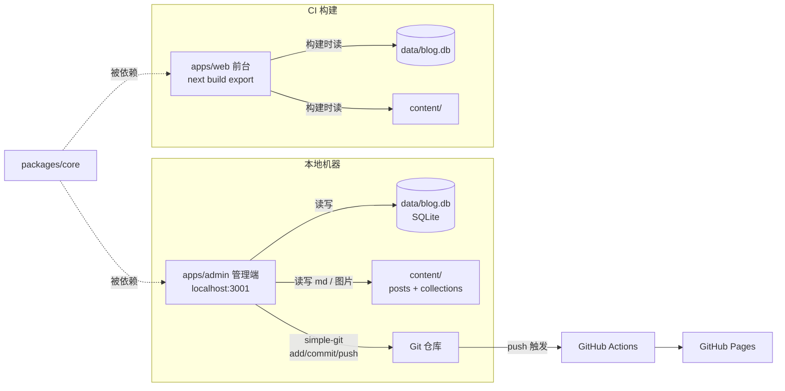
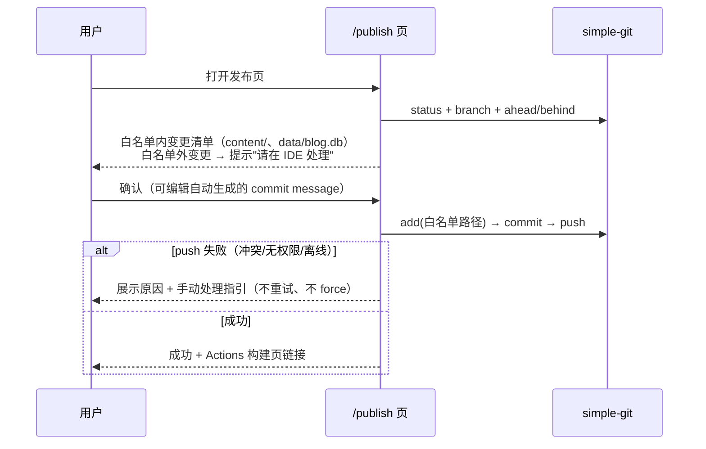

# cBlog 重构技术设计文档

- 版本：v1.0（2026-08-14）
- 关联文档：[PRD](./01-prd.md) · [测试计划](./03-test-plan.md)
- 章节编号与 PRD 功能需求（FR-x）对应关系在各节标注

## 1. 架构总览



要点：

- **数据流单向清晰**：管理端是唯一写入方（数据库 + md + 图片）；前台构建只读。
- **数据库随仓库走**：CI checkout 后 `data/blog.db` 就在本地，构建零外部依赖、零 secret（NFR-5）。
- **core 是唯一共享层**：数据库访问、内容读写、Markdown 渲染管道都收敛于此，web 与 admin 不允许绕过 core 直接操作数据库或 frontmatter。

## 2. 目录结构（目标态）

```text
cBlog/
├── apps/
│   ├── web/                        # 博客前台（现有代码迁入）
│   │   ├── app/                    # 现 app/ 平移，含新增 [collection] 动态路由
│   │   ├── components/             # 现 components/ 平移
│   │   ├── lib/                    # 仅保留 web 特有逻辑（brand 等），posts/site 移入 core
│   │   ├── public/
│   │   │   └── content/            # 构建前由脚本同步的随文档资产（gitignore）
│   │   ├── scripts/sync-content-assets.mjs
│   │   ├── next.config.js
│   │   └── package.json            # @cblog/web
│   ├── admin/                      # 管理端（新增，仅本地 dev 运行）
│   │   ├── app/
│   │   │   ├── page.tsx            # 仪表盘
│   │   │   ├── posts/…             # 列表 / new / [id] 编辑器
│   │   │   ├── categories/page.tsx
│   │   │   ├── collections/…       # 列表 / [id] 文档管理
│   │   │   ├── publish/page.tsx
│   │   │   └── api/…               # 见 §6.2
│   │   └── package.json            # @cblog/admin
│   └── (空，joyboy/onepiece/backend 已迁出至 docs/projects/)
├── packages/
│   └── core/                       # @cblog/core
│       ├── src/
│       │   ├── db/schema.ts        # Drizzle schema
│       │   ├── db/client.ts        # better-sqlite3 连接（单例）
│       │   ├── repo/posts.ts       # 仓储层（见 §5）
│       │   ├── repo/categories.ts
│       │   ├── repo/collections.ts
│       │   ├── content/frontmatter.ts   # 解析/序列化（字段顺序固定）
│       │   ├── content/files.ts    # 原子写、脚手架、路径白名单校验
│       │   ├── content/import.ts   # 全量导入 / 漂移检测
│       │   ├── markdown/render.ts  # markdownToHtml（纯函数，浏览器可用）
│       │   ├── paths.ts            # resolveRepoRoot 等
│       │   └── utils/…             # slug、readingTime 等
│       ├── drizzle/                # 迁移文件（提交仓库）
│       └── package.json
├── content/
│   ├── posts/<分类>/<年份>/<slug>/index.md      # 文章（assets/ 子目录放图）
│   ├── collections/<专栏>/<slug>.md             # 专栏文档（迁自 docs/）
│   └── .trash/                     # 软删除（gitignore）
├── data/blog.db                    # SQLite（提交仓库）
├── docs/projects/                  # joyboy/onepiece/backend 记录资料（gitignore）
├── pnpm-workspace.yaml             # packages: ["apps/*", "packages/*"]
└── .github/workflows/deploy.yml
```

根 `package.json` scripts：

```jsonc
{
  "dev:web": "pnpm --filter @cblog/web dev",
  "dev:admin": "pnpm --filter @cblog/admin dev",   // 端口 3001
  "build": "pnpm --filter @cblog/web build",
  "db:migrate": "pnpm --filter @cblog/core db:migrate",
  "content:import": "pnpm --filter @cblog/core content:import",  // FR-2.2/2.4
  "content:check": "pnpm --filter @cblog/core content:check"     // 漂移检测 FR-2.5
}
```

## 3. 路径解析与工作区约定

- content/、data/ 位于仓库根，被两个 app 共享。core 提供 `resolveRepoRoot()`：从 `process.cwd()` 向上查找 `pnpm-workspace.yaml`，保证在 apps/web、apps/admin、CI 任意工作目录下解析一致。
- 所有文件路径在数据库中存**相对 content/ 的 POSIX 风格路径**（如 `posts/technical/2026/foo/index.md`），跨平台稳定。
- 写路径白名单（NFR-4）：core 的写 API 统一经 `assertWritablePath()`——规范化后必须落在 `content/` 或 `data/` 内；slug 校验 `^[a-z0-9]+(?:-[a-z0-9]+)*$`，拒绝 `.`、`/`、`..` 等，从根上杜绝路径穿越。

## 4. 数据库设计（FR-2）

技术：`better-sqlite3`（同步 API，适合构建脚本与本地 API）+ `drizzle-orm` + `drizzle-kit`（迁移文件入库）。时间统一 ISO-8601 文本。

```ts
// packages/core/src/db/schema.ts（节选核心字段）
export const categories = sqliteTable("categories", {
  id: integer("id").primaryKey({ autoIncrement: true }),
  slug: text("slug").notNull().unique(),          // 创建后锁定
  name: text("name").notNull(),
  description: text("description").notNull().default(""),
  sortOrder: integer("sort_order").notNull().default(0),
  createdAt: text("created_at").notNull(),
  updatedAt: text("updated_at").notNull(),
});

export const posts = sqliteTable("posts", {
  id: integer("id").primaryKey({ autoIncrement: true }),
  slug: text("slug").notNull().unique(),          // 创建后锁定
  title: text("title").notNull(),
  excerpt: text("excerpt").notNull().default(""),
  status: text("status", { enum: ["draft", "published", "archived"] })
    .notNull().default("draft"),
  categoryId: integer("category_id").notNull().references(() => categories.id),
  filePath: text("file_path").notNull().unique(), // 相对 content/
  coverImage: text("cover_image"),                // 相对路径或旧式 /images 绝对路径
  date: text("date").notNull(),                   // 展示用发布日期，可编辑
  updatedAt: text("updated_at"),                  // 展示用更新时间，可空（存量文件非必填）
  createdAt: text("created_at").notNull(),
}, (t) => [index("idx_posts_status").on(t.status),
           index("idx_posts_category").on(t.categoryId)]);

export const tags = sqliteTable("tags", {
  id: integer("id").primaryKey({ autoIncrement: true }),
  name: text("name").notNull().unique(),
});

export const postTags = sqliteTable("post_tags", {
  postId: integer("post_id").notNull().references(() => posts.id, { onDelete: "cascade" }),
  tagId: integer("tag_id").notNull().references(() => tags.id, { onDelete: "cascade" }),
  position: integer("position").notNull().default(0),  // 保持标签在文中的原始顺序
}, (t) => [primaryKey({ columns: [t.postId, t.tagId] })]);

export const collections = sqliteTable("collections", {
  id: integer("id").primaryKey({ autoIncrement: true }),
  slug: text("slug").notNull().unique(),          // 即 URL 一级段，如 rightCapital
  name: text("name").notNull(),
  description: text("description").notNull().default(""),
  sortOrder: integer("sort_order").notNull().default(0),
  createdAt: text("created_at").notNull(),
  updatedAt: text("updated_at").notNull(),
});

export const collectionItems = sqliteTable("collection_items", {
  id: integer("id").primaryKey({ autoIncrement: true }),
  collectionId: integer("collection_id").notNull()
    .references(() => collections.id),
  slug: text("slug").notNull(),                   // 专栏内唯一
  title: text("title").notNull(),
  excerpt: text("excerpt").notNull().default(""),
  status: text("status", { enum: ["draft", "published", "archived"] })
    .notNull().default("published"),
  sortOrder: integer("sort_order").notNull().default(0),
  filePath: text("file_path").notNull().unique(),
  createdAt: text("created_at").notNull(),
  updatedAt: text("updated_at").notNull(),
}, (t) => [uniqueIndex("uq_collection_slug").on(t.collectionId, t.slug)]);
```

实现注记：pnpm 严格依赖隔离下，Next.js 对原生模块的 externals 解析要求 `better-sqlite3` 同时声明为 `apps/web` 的直接依赖（与 core 同版本，实际为同一实例）；`next.config.js` 配 `transpilePackages: ["@cblog/core"]` + `serverComponentsExternalPackages: ["better-sqlite3"]`。存量 `coverCard` 字段在解析层归一为 `coverImage`。

约束与派生规则：

- `readingTime` 不入库，构建/展示时由正文计算（沿用现算法）。
- 有文章的分类、有文档的专栏禁止删除（仓储层校验，FR-4.2/5.1）。
- 保留专栏 slug `rightCapital`、`addx-ai` 原样迁移，保证 URL 兼容（FR-5.3）。
- **db 文件入库的权衡**：二进制 diff 不可读——由回写的 frontmatter 提供可读 diff；文件损坏/冲突时用 `content:import` 从文件全量重建（FR-2.4 是灾备手段）。

## 5. packages/core API 设计

仓储层（同步函数，供构建与 API 路由使用）：

```ts
// repo/posts.ts
listPosts(filter?: { status?; categorySlug?; tag?; keyword? }): PostMeta[]
getPostBySlug(slug): PostWithContent | null      // 元数据来自 DB，正文读文件
createPost(input: { title; slug; categorySlug }): PostMeta   // 建目录+脚手架+入库
savePost(id, patch: { title?; excerpt?; tags?; coverImage?; date?; categoryId?; content? }): void
setPostStatus(id, status): void
deletePost(id): void                              // 移入 content/.trash/ + 删记录
// repo/categories.ts / repo/collections.ts 同构：list/create/update/remove、reorderItems(collectionId, orderedIds)
```

内容 IO 层：

- `serializeFrontmatter(meta)`：字段顺序固定为 `title, date, updatedAt, category, tags, excerpt, coverImage, status`，YAML 输出稳定 → git diff 干净（FR-2.3）。
- `writeFileAtomic(path, content)`：临时文件 + `rename`（NFR-4）。
- **保存事务顺序**：组装新 frontmatter + 正文 → 原子写 md → 数据库事务 upsert。数据库失败时用内存中的旧内容回写文件恢复，保证两边不长期分叉。
- `importFromFiles({ mode })`：全量扫描 content/，`upsert by filePath`，文件侧为准（FR-2.2/2.4，幂等）；专栏迁移时同时解析 rightCapital 文件名序号 / addx-ai 元数据映射为 `sortOrder`。
- `driftCheck()`：对比全部 md frontmatter 与数据库，返回差异清单；web 构建 prebuild 调用，仅告警（FR-2.5）。

Markdown 渲染层：现 `lib/posts.ts` 中 remark 管道 + `enhanceMermaidBlocks` + 标题 ID 逻辑抽为**纯函数**（不含 fs/env 访问，basePath 作参数传入），使 admin 预览与 web 构建复用同一实现（FR-3.3 预览一致性的根基）。

## 6. 管理端设计（FR-3 ~ FR-7）

### 6.1 形态与页面

Next.js 14 App Router（与 web 同版本），仅 `next dev` 运行于 3001 端口，永不部署（NFR-3：不在 CI 构建范围）。页面：

| 路由 | 内容 |
|------|------|
| `/` | 仪表盘：文章/草稿/归档计数、分类分布、最近编辑 |
| `/posts` | 列表 + 筛选（状态/分类/标签/关键词） |
| `/posts/new` | 新建表单（分类、标题、slug 预览与校验） |
| `/posts/[id]` | 编辑器页（见 6.3） |
| `/categories` | 分类 CRUD |
| `/collections`、`/collections/[id]` | 专栏 CRUD、文档列表与拖拽排序 |
| `/publish` | 变更清单 + 一键发布 |

### 6.2 API 路由

| Method & Path | 行为 |
|---|---|
| `GET/POST /api/posts` | 列表（带筛选 query）/ 新建（FR-3.2） |
| `GET/PUT /api/posts/[id]` | 详情（含正文）/ 保存元数据+正文（FR-3.3/3.4） |
| `POST /api/posts/[id]/status` | 状态流转（FR-3.5） |
| `DELETE /api/posts/[id]` | 软删除（FR-3.6） |
| `GET/POST/PUT/DELETE /api/categories…` | 分类 CRUD（FR-4） |
| `GET/POST/PUT/DELETE /api/collections…`、`POST /api/collections/[id]/reorder` | 专栏与文档管理（FR-5） |
| `POST /api/images` | multipart 上传，落盘该文档 `assets/`（FR-6） |
| `GET /api/publish/status` | git status（白名单内/外分组）+ 分支 + ahead/behind |
| `POST /api/publish` | add(白名单) → commit → push（FR-7） |

所有 handler 直接调 core 仓储层；错误统一 `{ error: { code, message } }`。

### 6.3 编辑器

- **CodeMirror 6**（`@codemirror/lang-markdown`）左侧源码；右侧预览调 core 的 `markdownToHtml`（浏览器端执行）+ 懒加载 mermaid 渲染，300ms 防抖。
- 元数据表单与正文同页（侧栏面板），保存合并为一次 `PUT /api/posts/[id]`。
- `Cmd+S` 保存；`beforeunload` + 路由守卫拦截未保存离开（FR-3.3）。
- 图片：监听 paste/drop → `POST /api/images`（携带 postId）→ 返回 `./assets/<name>` → 插入光标处（FR-6.1）。文件名规范化 + 冲突加短 hash 后缀。

### 6.4 Git 集成（FR-7）

`simple-git`。发布序列：



默认 commit message 规则：单篇变更 `post: <动作> <标题>`；多处变更 `content: update N posts/…`。

## 7. 前台（web）改造（FR-8）

### 7.1 数据源切换

`lib/posts.ts` 职责拆解：元数据查询 → core 仓储层（数据库）；正文读取与渲染 → core content/markdown 层。生产构建取 `status = published`；`next dev` 额外含 `draft`；`archived` 任何模式不出现（PRD §4）。分类、导航（分类 + 专栏两组动态项）全部来自数据库，删除 `postCategories` 硬编码。

### 7.2 专栏通用路由

- 删除 `app/rightCapital/`、`app/addx-ai/`，新增：
  - `app/[collection]/page.tsx` — 专栏落地页（通用模板，基于现 rightCapital 样式泛化）
  - `app/[collection]/[slug]/page.tsx` — 文档页
- `generateStaticParams` 从数据库枚举专栏与已发布文档。Next.js 静态段优先于动态段，`/about`、`/posts` 等既有路由不受影响；`output: export` 下仅生成枚举出的路径，不存在通配污染。
- **风险与守护**：新建专栏 slug 不得与既有静态路由段冲突 → core 维护保留字清单（`posts/categories/about/brand/api/...`），创建时校验拒绝。

### 7.3 随文档资产管道（FR-6.3 / FR-10.2）

`sync-content-assets.mjs`（web prebuild）：

1. 扫描 `content/**` 非 md 文件 → 镜像复制到 `apps/web/public/content/<原相对路径>`（gitignore，构建时生成）。
2. 复制时经 sharp：位图压缩 + 生成 `.webp` 副本（>50KB 时替换引用，原图保留兜底）；SVG 原样。
3. `markdownToHtml` 渲染阶段将相对引用 `./assets/x.png`（含封面字段）重写为 `${basePath}/content/<文档目录>/assets/x.webp|png`。
4. 旧式 `/images/...` 绝对路径逻辑原样保留（兼容存量）。

dev 模式跳过压缩仅做镜像同步（watch 可后续加，v1 编辑图片后刷新即可）。

### 7.4 CI 变更

`deploy.yml` 仅改三处：build 步骤 `pnpm --filter @cblog/web build`；artifact 路径 `apps/web/out`；其余（pnpm/Node 版本、BASE_PATH 逻辑）不变。

## 8. Mermaid 查看器（FR-9）

现 `MermaidEnhancer` 拆为两部分：渲染器（列表页/文章页内联渲染）+ 新 `MermaidViewer`（全屏查看）。

- **渲染时机**：每个图例挂 IntersectionObserver，进入视口才调 `mermaid.run`（FR-10.1）；mermaid 库维持动态 import。
- **查看器交互**：自定义 `usePanZoom` hook（约 150 行，零新依赖）：
  - 状态 `{ scale, tx, ty }`，应用于包裹 SVG 的容器 `transform: translate(tx,ty) scale(scale)`，`transform-origin: 0 0`；
  - wheel：`scale' = clamp(scale * e^(-ΔY·k), 0.25, 8)`，并按光标位置调整 tx/ty 实现锚点缩放；
  - pointer events 统一鼠标/触摸拖拽；双指捏合按两触点距离比例缩放；双击 ×1.5；
  - 工具栏 +/− / 重置 / 适配宽度（按 SVG viewBox 与视口比例计算初始 scale，打开时默认执行）；
  - ESC / 遮罩点击关闭；`requestAnimationFrame` 合帧更新，`will-change: transform`。
- 内联预览：`max-height: 480px` + `object-fit` 式约束，保留 figcaption 提示（FR-9.4）。

## 9. 性能优化（FR-10）

| 项 | 方案 | 阶段 |
|----|------|------|
| Mermaid 懒渲染 | §8 IntersectionObserver | Phase 5 |
| 图片压缩/WebP | §7.3 资产管道 | Phase 5（管道本体 Phase 4 随图片功能落地） |
| 大组件懒加载 | KnowledgeGraphExplorer 等 `next/dynamic` | Phase 5 |
| 包体基线 | `@next/bundle-analyzer`，重构前后各出一次报告 | Phase 1 / Phase 5 |

## 10. 实施步骤（映射 PRD §7 里程碑）

1. **Phase 0**：`git rm` apps/joyboy 内被跟踪文件 → 三个目录移至 `docs/projects/` → gitignore 追加该路径。
2. **Phase 1**：建 workspace → web 代码平移 `apps/web`（含 tailwind/tsconfig/next.config 路径修正）→ 根 scripts → CI 适配 → **产物等价校验**（重构前后各构建一次，比对 `out/` 文件清单与 sitemap，详见测试计划 MIG 用例）。
3. **Phase 2**：core 包 + schema + 迁移 → `content:import` 建库 → web 数据源切至 DB（frontmatter 此时仍在，作导入源）→ 再次产物等价校验 → 提交 `data/blog.db`。
4. **Phase 3**：`docs/rightCapital`、`docs/addx-ai` 迁入 `content/collections/`（补 frontmatter，序号入库）→ 通用路由上线 → 删除旧路由与加载器 → URL 等价校验。
5. **Phase 4**：admin 应用（顺序：仓储 API → 列表/新建 → 编辑器 → 图片 → 分类/专栏 → 发布页）。
6. **Phase 5**：Mermaid 查看器 + 懒渲染 + 图片压缩 + 懒加载 + 包体报告。

## 11. 风险与对策

| 风险 | 影响 | 对策 |
|------|------|------|
| 根级动态路由与未来静态路由冲突 | 专栏页互相覆盖 | 保留字清单校验（§7.2）；测试覆盖 |
| db 与 frontmatter 漂移（IDE 手改文件） | 展示与库不一致 | 构建期 driftCheck 告警 + `content:import` 重导入（文件优先） |
| db 二进制合并冲突 | 无法 merge | 单作者 + 单写入方；冲突时任取一方后 `content:import` 重建 |
| 保存中途失败 | 文件/库分叉 | 原子写 + 失败回滚旧文件（§5） |
| 产物 URL 回归 | 外链失效 | 每阶段 sitemap/文件清单等价校验为合并前置条件 |
| basePath 场景图片路径错误 | Pages 上图挂 | 渲染层统一重写 + 带 basePath 的构建冒烟用例 |
| CodeMirror/mermaid 进 web 包体 | 前台变慢 | 编辑器仅存在于 admin；包体基线报告对比（NFR-3） |
