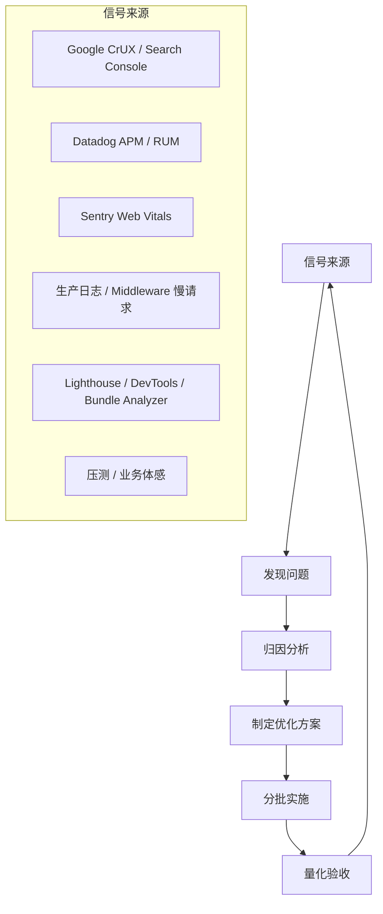

## 前端性能常用指标有哪些，你们公司的标准是什么

前端常用性能指标，我一般会分 3 组来讲：

- **响应类**
  - `TTFB`：首字节时间，看服务端和链路快不快。
  - 接口 `P50 / P95 / P99`：看平均快不快，以及尾部慢不慢。

- **加载与渲染类**
  - `FCP`：用户第一次看到内容的时间。
  - `LCP`：首屏主要内容真正出来的时间。
  - `CLS`：页面抖不抖、跳不跳。
  - `INP`：用户点了之后，页面多久真正响应。
  - `TTI`：老一点的口径，表示页面什么时候可交互，有些老文档还会看。

- **业务体验类**
  - 搜索响应时间
  - 支付 SDK 加载耗时
  - 下单链路成功率 / 错误率
  - 转化漏斗各阶段耗时和流失

如果结合我们当前这个项目说“你们公司的标准是什么”，比较真实的回答是：

- **没有看到一个全站统一写死的 TTFB 单指标标准**
  - 更像是 **按场景分层管理**，不是只盯一个数。

- **Web Vitals 口径是明确在看的**
  - 项目里有 `mobile INP > 200ms` 的专项问题分析，说明 `INP 200ms` 是团队明确关注线。
  - 代码里当前真正落地监控最明显的是 `CLS`：
    - 生产环境抽样 10%
    - `CLS > 0.15` 会被上报到 Sentry 做告警和归因

- **Search / PLP 这类页面有更具体的目标**
  - 首屏加载时间不超过 `2s`
  - `FCP <= 1.2s`
  - 搜索响应时间不超过 `500ms`
  - `TTI <= 3s`
  - Web Vitals 达到 “Good”

- **交易链路看得更业务化**
  - 不只是看页面快不快，还看关键接口 `P50/P95/P99`
  - 也看 `LCP / INP`
  - 还会单独看支付 SDK 加载耗时、成功率、错误率

所以更准确地说，我们这边的标准不是“TTFB 小于多少就完事”，而是：

- 基线用 **Core Web Vitals**
- 页面级再补 **FCP / 首屏 / 搜索响应**
- 交易链路再补 **接口延迟和成功率**

**面试回答版本**

`TTFB` 就是从浏览器发起请求到收到第一个字节的时间，它主要反映 CDN、网络、服务端处理和缓存效率，不是单纯前端渲染时间。

前端常用指标我一般分三类：  
第一类是响应类，比如 `TTFB` 和接口 `P95/P99`；  
第二类是页面体验类，比如 `FCP`、`LCP`、`INP`、`CLS`；  
第三类是业务类，比如搜索响应时间、支付 SDK 加载耗时、下单成功率。

如果结合我们项目来说，我们不是只盯一个 TTFB 数字，而是分层看。  
像 Search/PLP 这边，文档里有比较明确的目标：首屏 `2s` 内，`FCP <= 1.2s`，搜索接口 `<= 500ms`，`TTI <= 3s`，同时 Web Vitals 要达到 good。  
监控侧当前真正落地比较明确的是 Web Vitals，尤其是 `CLS`，生产环境有抽样上报，`CLS > 0.15` 会进 Sentry；另外团队也有专门分析过移动端 `INP > 200ms` 的问题，所以 `INP` 也是明确关注项。  
交易链路则更看重接口 `P95/P99`、LCP/INP 和支付相关耗时，因为这些会直接影响转化。

## 你们在实际项目中是如何定位性能问题的？

多平台多维度调研现状发现 → 归因分析 →按照优先级分层拆解（P0 全局问题，P1 交互路径，按页面类型汇总） → 按 ROI 分批落地 → 量化验收

| 类型                  | 典型指标              | 主要发现手段                     |
| --------------------- | --------------------- | -------------------------------- |
| **用户体验（CWV）**   | LCP、CLS、INP         | CrUX、PageSpeed、Sentry CLS 上报 |
| **接口 / 服务端**     | P95/P99、Trace 瀑布图 | Datadog APM、生产 API 耗时统计   |
| **前端工程 / Bundle** | JS 体积、HMR 慢       | `pnpm web:analyze`、本地开发体感 |

---

1. 真实用户数据（CWV / SEO 维度）

- **Lighthouse**：本地 DevTools 单次测量
- **PageSpeed Insights**：线上实时测量
- **Google Search Console**：Chrome 真实用户访问的 CWV 汇总

本地 `docs/INP-issue-longer-than-200ms-mobile/analysis.md` 是更近期的典型案例：从 CrUX / Search Console 类数据发现 **移动端 INP > 200ms**，影响约 5000+ URL，并按页面类型（PLP、PDP、Homepage 等）列出严重程度和趋势。

这说明 CWV 类问题通常是：**外部平台报警 → 按 URL / 页面类型分组 → 本地写 RCA 文档**。

2. Sentry + 自研 Web Vitals 上报（CLS 精确定位）

Joyboy 在 `web-vitals.tsx` 里对 **CLS > 0.15** 做了 10% 采样上报，并定位到具体 DOM 元素：

上报时会解析 layout shift 的 DOM 节点、祖先上下文、页面类型，并通过 `captureStructuredMessage` 发到 Sentry，便于按 `primaryCulprit` fingerprint 分组。CHANGELOG 里也有对应记录（如 cms-banner CLS 修复 #1155）。

这是 **从「指标异常」到「具体组件」** 的关键桥梁。

3. 生产日志 / Middleware 慢请求监控

Middleware 链配置上报，`MIDDLEWARE_LOGGING_GUIDE.md` 还提到生产环境会过滤 <100ms 的快请求，减少日志噪音。

4. 压测与稳定性告警

用于高并发下的容量与稳定性验证，与「单次请求慢」形成互补。

## INP 超标通常怎么排查?

INP 超标我会先从 RUM(Real User Monitoring，真实用户监控，通过在网页中植入脚本，实时收集真实访问用户的浏览器数据) 定位慢交互，再用 Performance 看主线程 long task，用 React Profiler 看是不是大范围重渲染，最后排查 layout 计算和第三方脚本。优化方向就是缩短交互后的同步任务，让首帧反馈先出来，非关键更新延后。

大部分情况是需要排查代码逻辑，首先分析是哪类交互，是不是这次交互会触发大量的计算和渲染导致加载比较慢，或者是触发了一些第三方脚本和一些长任务，

## 页面卡顿如何定位？Performance 面板看什么？

先录制问题操作，然后找到卡顿时间点，看这一段主线程 是 JS、render、layout、paint 还是 network 在耗时；如果是 JS，再用 Call tree 找函数；如果是 React 更新，再用 Profiler 找是哪批组件重渲染；最后再决定是拆任务、降渲染、缓存计算、虚拟列表，还是延后第三方脚本。

## bundle是什么

狭义上 bundle 就是客户端需要加载的 JS；广义上 bundle 是构建后的代码产物，包括 server bundle 和 client bundle。性能优化里我们最关注的是 client bundle，因为它会直接影响首屏加载、hydration 和交互性能。

## Bundle 过大怎么分析？你们的Bundle有优化过吗？

Next 有一个库可以是专门分析构建之后的bundle的，他运行之后会用可视化的方式展示各个维度下的bundle大小，我们可以显示对比不同路由、不同module下、甚至各个组件的bundle size

优化手段一般是这几类：
路由级拆分Next App Router 本身会按 segment 切 chunk，但如果某个页面 client 入口太大，还要继续拆子组件
减少 client bundle能放 RSC 的数据处理、静态渲染、配置逻辑，不放进 client component
优化第三方包引入避免整包 import，使用按需 import
处理错误依赖进入客户端比如 Node-only 模块要 alias 掉，项目里就有防止 async_hooks 进入 client bundle 的处理

总的来说：
Bundle 优化不是看到大就乱拆，而是先用 analyzer 找到哪个 route、哪个 chunk、哪个依赖变大，再判断它是不是首屏必须。如果不是首屏必须，就动态加载或下沉；如果是公共依赖变大，就查 import 方式、client 边界和组件库入口。

## Tree Shaking 为什么有时候不生效？

Tree Shaking 依赖静态 ESM 和无副作用判断。它不生效通常是因为用了 CommonJS、barrel export(export \*) 太重、文件有顶层副作用、或者构建链路把 ESM 转掉了。

实际排查时我会先看 analyzer 里是哪一个包没被摇掉，再看 import 方式、包的 module/exports 字段和 sideEffects 配置。

## dynamic import 的边界是什么？会不会影响用户体验？

dynamic import 不是越多越好。它适合拆非首屏、低频、重依赖组件；首屏核心内容和关键交互不应该随便拆。它能降低初始 bundle，但会把成本转移到首次使用时，所以必须配合 skeleton、prefetch、错误兜底和稳定布局，否则会影响用户体验。

## 字体子集化怎么做？有什么副作用？

字体子集化是按语言、字符集、字重把完整字体裁成更小的 woff2，再通过 unicode-range 按需加载。它能明显减少字体体积，但副作用是缺字 fallback、多语言维护成本、字体切换导致 CLS，以及拆太细带来的请求数增加。

## 搜索双层客户端缓存具体是哪两层？

第一层是 **已完成结果缓存 `resultCache`**。  
同一个搜索请求参数生成同一个 `requestKey`，如果之前已经成功返回过结果，就直接从 `clientResultCache` 里拿，不再发请求。这个缓存有 TTL，代码里是 5 分钟，并且有最大数量限制，超过后按类似 LRU 的方式清理。

第二层是 **进行中请求缓存 `pendingCache`**。  
如果用户连续触发了相同搜索，比如筛选状态抖动、组件重复 mount、同参数请求并发进来，第一请求还没回来时，后续请求不会再发新的网络请求，而是复用同一个 pending promise。

面试里可以这样说：

搜索客户端缓存分两层：第一层缓存已经完成的搜索结果，用来加速重复搜索；
第二层缓存进行中的请求，用来合并并发的相同请求，避免同一个 query/filter 连续打多次接口,筛选状态抖动、组件重复 mount等。

SSR initialResults 也有复用逻辑，但它更像首屏 hydration 优化，不是这套双层 client cache 的核心。

## 上面说的相同请求不会再发起新的二是服用旧的，进行中请求去重怎么实现？key 如何设计？

进行中请求去重就是用 Map 缓存同参数请求的 Promise。

请求进来先生成稳定 requestKey，如果 key 已存在就复用 promise，不再发新请求；请求完成后 finally 删除。key 的设计要覆盖所有会影响结果的参数，比如 query、filter、sort、page、locale、region、zipcode、feature flag，同时排除不影响结果的 UI 状态，并且要做稳定序列化。

## 简历中说到的从 200ms 到 <5ms 是接口变快了，还是命中缓存？

从 200ms 到 <5ms 主要是缓存命中。200ms 是真实请求链路，<5ms 是客户端内存缓存返回。

结合我们搜索这套双层缓存：

- 如果是 已完成结果缓存命中第二次相同 query/filter/page 请求直接从 resultCache 返回
  这个时间可以做到几毫秒以内
- 如果是 进行中请求去重命中它不是接口变快，而是后续请求复用了第一个请求的 Promise
  网络只发一次，多个调用共享结果

## 简历中说的减少 30% 请求量是怎么统计的？

**30% 请求量下降，是按同一搜索路径、同一时间窗口、同一类请求口径对比出来的，不是全站请求量。**  
比如我们看的是搜索页 `/api/search` 或 Algolia search 这类请求，在优化前后分别取一段稳定时间窗口，排除发布、活动流量和异常错误，然后对比同等 PV / session 下的请求次数。

具体会看几个指标：

- **总请求数**
  - 优化前后搜索接口请求总量变化
- **每次搜索会话请求数**
  - 比如一次用户搜索、筛选、翻页平均打几次请求
- **每个 PV 请求数**
  - 避免只是流量变少导致请求数下降
- **重复请求比例**
  - 同一个 `query + filter + page + region` 在短时间内重复出现多少次
- **pending 去重命中率 / result cache 命中率**
  - 这个最好从日志或埋点里直接统计

所以如果面试官追问“你怎么证明是缓存带来的”，我会补：

- 看 Network 或日志里相同 `requestKey` 的重复请求是否减少
- 看客户端 cache hit 日志是否增加
- 看接口 QPS 是否下降，但页面搜索交互量没有下降
- 看 P95/P99 响应时间和错误率有没有同步改善

一句话版本：

30% 不是拍脑袋，是按搜索接口请求量做 before/after 对比，并且归一化到 PV 或搜索 session。我们会同时看 requestKey 维度的重复请求减少、cache hit 记录、接口 QPS 下降，以及用户搜索行为量是否基本一致，来证明请求量下降是缓存和 pending 去重带来的。
