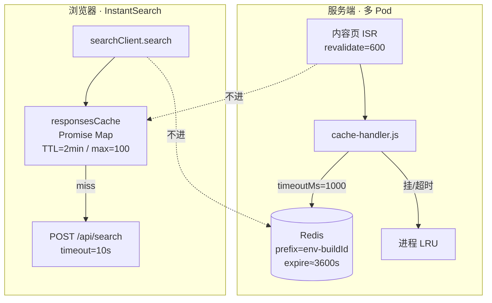

# ISR + Redis / 搜索缓存 · 深度笔记

> 基于 Joyboy 真实代码：`apps/web/cache-handler.js`、`next.config.js`、`search-client.ts`。  
> 体例对齐：[9.Checkout-Payment.md](./9.Checkout-Payment.md)（解释版本 + 面试回答版本）+ Joyboy deep dive 的对照表 / 面试 Q 表。  
> 速记：[addx-ai/04-性能与缓存.md](../addx-ai/04-性能与缓存.md) · 场景卡：[08 卡片 B](../addx-ai/08-场景题与深挖卡片.md)  
> ⚠️ Joyboy `docs/search-result-cache.md` 已过时（5min/50、`clearSearchResultCache`）；以 `search-client.ts` 为准。

**一句话**：Redis 管 Next **Full Route Cache / Data Cache** 的跨 Pod 共享；搜索「两层」是浏览器内存里 **结果 TTL + in-flight Promise**——两套系统不要讲成一套。

---

## 〇、两套系统对照（先别混）

| 维度 | ISR + Redis（Cache Handler） | 搜索 responsesCache |
| --- | --- | --- |
| 位置 | `cache-handler.js` + `next.config.js` | `libs/modules/search/.../search-client.ts` |
| 运行时 | Node 生产多 Pod | 主要浏览器；SSR 有 ephemeral 一份 |
| 存储 | Redis；失败→进程内 LRU | 页签内存 `Map` |
| 缓存什么 | 页面 HTML、`fetch` / `unstable_cache` | InstantSearch `search()` 的 **Promise** |
| 典型 TTL | 页面 `revalidate≈600s`；Redis expire 估 **3600s** | **2 分钟** |
| 超时 | Redis 操作 **`timeoutMs: 1000`** | 单次搜索 HTTP **10s** |
| PLP/Search | **不走 ISR**（`force-dynamic`） | **要**：hydrate + 客户端去重 |



---

## 一、为什么要 ISR + Redis

**解释版本**

Next.js 自带 ISR / Full Route Cache **没问题**，但默认偏「当前进程内存」。线上是多 Pod：

1. 用户打到 Pod A → A 生成并缓存  
2. 下次打到 Pod B → B 本地没有 → 再生成一次  
3. 命中率差、重复回源、实例间新旧不一致  

所以要解决的是 **共享** 和 **失效一致**，不只是「再快一点」。

项目落地（`next.config.js`）：

- production：`cacheHandler → ./cache-handler.js`（`@neshca/cache-handler` + redis-strings）  
- `cacheMaxMemorySize: 0`：关掉默认内存层，避免「本地一份、Redis 一份」语义混乱  
- 本地 / CI 不启用 Redis handler  

**面试回答版本**

"默认 ISR 适合单实例。我们多 Pod，不共享就会重复生成、命中率差。生产用自定义 cacheHandler 把缓存后端换成 Redis，并关掉默认内存缓存。Redis 挂了降级进程内 LRU，站点还能跑，只是暂时不跨 Pod 共享。"

---

## 二、cache-handler 现行实现

**解释版本**

核心在 `apps/web/cache-handler.js`：

```js
handler = await createRedisHandler({
  client,
  keyPrefix: `${process.env.APPLICATION_ENV}-${buildId}:`,
  timeoutMs: 1000,
});

return {
  handlers: [handler],
  ttl: { estimateExpireAge: (staleAge) => 3600 },
};
```

| 项 | 值 | 含义 |
| --- | --- | --- |
| keyPrefix | `env-buildId:` | 环境隔离 + **发版换命名空间**，旧 build 脏缓存不污染新版本 |
| timeoutMs | **1000** | **单次 Redis 操作超时**（不是缓存 TTL、不是 revalidate） |
| estimateExpireAge | **恒定 3600s** | Redis key 物理过期约 1h |
| 连接失败 | `createLruHandler()` | 进程内 LRU 兜底 |
| 启动 connect | **无超时** | 注释已写明；可能阻塞进程起来——主动承认 |

业务页常见：`export const revalidate = 600`（home / blog / help-center / `[...rest]` CMS 等）。  
Storyblok Data Cache：`unstable_cache` + tags，`NEXT_PUBLIC_STORYBLOK_REVALIDATE_TIME` 默认也是 **600**。  
主动失效：`app/api/storyblok/route.ts` → `revalidateTag` / `revalidatePath`。

`instrumentation.js` 里 `registerInitialCache` **目前注释掉**——不靠启动灌全量，靠流量回填。

**面试回答版本**

"Handler 用 neshca 的 redis-strings。key 带环境和 buildId，发版天然隔离。操作超时 1 秒，超时当 miss，不拖死 TTFB。物理过期估 1 小时，业务 revalidate 多为 10 分钟。CMS 变更走 webhook 打 tag，不靠干等 TTL。启动 connect 没有超时是已知限制。"

---

## 三、timeoutMs=1s 与 expire=3600 为什么这样定

**解释版本**

### timeoutMs: 1000

- 挂在渲染 / Data Cache **读路径**上。  
- Redis 半开或慢时，若干等默认 5s，TTFB 直接被拖死。  
- 超时 → 当次失败 → 回源或 LRU；**宁可少命中，不可整页挂起**。  
- 同 region ElastiCache 正常 RTT ≪ 1s；1s 区分「偶发慢」与「不可用」。

对比：搜索 HTTP 超时是 **10s**——那是主业务查询兜底，不能裁成 1s。

### estimateExpireAge → 3600 vs revalidate 600

| 概念 | 典型值 | 作用 |
| --- | --- | --- |
| 逻辑 stale（revalidate） | 600s | Next 认为可后台再生 |
| 物理 Redis expire | ~3600s | key 何时从 Redis 删掉 |

600s 后缓存变 stale，但 Redis 里往往还有旧值 → **先返回 stale，再后台再生**，避免多 Pod 同时硬 miss 打穿源站。若物理 TTL 跟 600 对齐，一到点 key 消失，高并发下容易雪崩式回源。

Tag 主动失效优先于等 TTL。

**面试回答版本**

"1 秒是 Redis 操作超时，不是缓存多久。缓存旁路读必须 fail-fast。3600 是物理过期，600 是业务 stale；物理大于逻辑，才能 stale-while-revalidate，防击穿。搜索超时 10 秒是另一条链路，别混。"

---

## 四、失效、击穿、雪崩、穿透（结合项目）

**解释版本**

| 问题 | 项目侧做法 |
| --- | --- |
| 失效 | 时间：`revalidate`；事件：Storyblok webhook + `revalidateTag/Path`；双保险 |
| 击穿（热点硬 miss） | 物理 TTL > stale；同请求内 `react cache` + `unstable_cache`（如 PDP data bucket） |
| 雪崩 | 不把大量 key 设成同一物理到期；降级 LRU；避免全站 purge |
| 穿透 | 空结果短 TTL/不缓存毒数据（搜索侧 artificial/失败直接驱逐） |

搜索侧的 in-flight Promise 合并，本质也是「热点单飞」，只是发生在浏览器，不在 Redis。

**面试回答版本**

"失效靠 TTL 加 webhook tag。防击穿主要靠物理过期长于业务 stale，以及请求内去重。雪崩靠错开过期和降级。穿透不靠缓存空结果硬扛。搜索并发去重是客户端 Promise 单飞，跟 Redis 击穿是同一思想、不同层。"

---

## 五、哪些页面不能上 Full Route Cache

**解释版本**

不能（或不该）做共享页缓存的特征：强个性化、强实时、强用户态、query 组合爆炸、依赖 cookie/库存/支付态。

项目事实：

| 类型 | 策略 |
| --- | --- |
| search / categories / collections / sales | `export const dynamic = 'force-dynamic'` |
| 产品核心 API | 常 `cacheOption: 'no-store'`（zip/库存/lead time） |
| cart / checkout / payment / account | 用户会话绑定，不进共享 ISR |
| wishlist 等 | 可能有 `revalidate=600` 的 **壳**；用户私有数据仍不靠共享 ISR |

> 架构文档写「PLP = SSR/ISR」是粗口径；**路由层事实是 force-dynamic**。

**面试回答版本**

"内容页 ISR + Redis；列表和交易链路不走共享 Full Route Cache。PLP 显式 force-dynamic，组合太多、还要跟搜索后端对齐。壳可以静态一点，用户核心数据必须私有、实时、不可共享。"

---

## 六、搜索 responsesCache（现行）

**解释版本**

权威实现：`createResponsesCache()` in `search-client.ts`。

### 它解决什么

自定义 searchClient **不是**官方 Algolia client。若不实现 v4 `transporter.responsesCache` 契约：

1. **Hydration 二次搜**：`InstantSearch.start()` 必 scheduleSearch；官方会预填 SSR 结果，第三方被 skip → 多一次相同 `POST /api/search` → Hits 进 loading → **闪烁**。  
2. **Facet 双 POST**：`react-instantsearch-nextjs` routing bridge 在 `pushState` 后再 `setUiState`，第二次参数与第一次相同。

### 「两层」是什么（面试口径）

**同一 `Map` 上的两种去重语义**（不是两个 Redis、也不是旧文档的两个独立 Map）：

```
get(key, fallback)
  ├─ entry 未过期 → return 同一个 Promise
  │     ├─ 已 resolve → 结果 TTL 命中
  │     └─ 仍 pending → in-flight 命中（并发合并）
  └─ miss → 立刻 set(Promise)，再跑网络
        成功保留；失败 / artificial 驱逐
```

| 「层」 | 机制 | 作用 |
| --- | --- | --- |
| 结果 TTL | `expiresAt = now + 2min` | 后退、同条件重复、routing 二次 search |
| in-flight | miss 时先写入未完成 Promise | 并发同 key 只打一次网 |

现行常量：

| 常量 | 值 |
| --- | --- |
| `RESPONSES_CACHE_TTL_MS` | **2 × 60 × 1000** |
| `RESPONSES_CACHE_MAX_ENTRIES` | **100**（FIFO） |
| `SEARCH_REQUEST_TIMEOUT_MS` | **10_000** |

Key：`stableStringify`；**`page=0` 与省略 page 归一**（SSR 常省略，hydration 常带 0）。  
`credentials: 'omit'`——搜索不自动带 cookie。  
Client 失败 **reject**（进 error UI）；SSR 失败 **resolve** 空结果（避免 RSC promise 挂死）。

Hydrated 页面还有「外层 hydrate override + 内层我们 wrap」双 key 空间，避免外层 fallback 读到自己刚写的 in-flight；面试优先讲 **Promise + TTL** 即可。

**面试回答版本**

"搜索缓存是浏览器内存，不进 Redis。我们实现 Algolia v4 的 responsesCache：Map 里存 Promise，2 分钟 TTL、最多 100 条。同一 key 未完成时后到的请求 join 同一个 Promise，完成后短时复用——这样就消掉 hydration 闪烁和 routing 双发。失败和降级空结果不缓存。PLP 路由本身是 force-dynamic。"

---

## 七、踩过的坑（可讲 STAR）

| 坑 | 表现 | 解法 |
| --- | --- | --- |
| 默认 ISR 上多 Pod | 重复回源、命中不稳 | Redis cacheHandler + 关内存双写 |
| Redis 强依赖 | 半开拖死 TTFB | timeoutMs=1s + LRU 降级 |
| stale=物理过期 | 到期硬 miss 打穿 | expire 估 3600 > revalidate 600 |
| 只靠定时 revalidate | CMS 改完几分钟才生效 | webhook + revalidateTag |
| 不该缓存的数据进缓存 | 错价/错库存/错列表 | force-dynamic / no-store |
| 第三方 searchClient | hydration 闪烁、facet 双 POST | responsesCache + transporter 契约 |
| 旧文档当 SLA | 背 5min/−30% 被追问穿 | 以 search-client 2min/100 为准 |

---

## 八、面试 Q 表（深挖用）

### Q1. Redis timeout 多久？为什么？

**1 秒（timeoutMs=1000）。** 是操作超时不是 TTL。旁路读必须快失败；等几秒会拖死首字节。库默认常 5s，我们更激进。

### Q2. Redis 条目实际过期多久？和 revalidate=600 什么关系？

物理 expire 估 **约 3600s**；逻辑新鲜度多为 **600s**。先 stale 再再生；tag 可立即失效。

### Q3. 搜索「两层」是什么？

同一 responsesCache：**结果 TTL 复用** + **in-flight Promise 合并**。旧「两个 Map」说法已废弃。

### Q4. in-flight + TTL 怎么实现？

`Map<key, { value: Promise, expiresAt }>`。miss 时先 set Promise 再 await；并发 join；失败 delete；artificial 不保留。

### Q5. 为什么搜索 TTL 是 2 分钟不是 5 分钟？

代码是 **2min**。够盖住双发和短时后退；PLP 价库存变化快，过长易陈旧。Key 含完整 filter——改条件必 miss。

### Q6. PLP 为什么不用 Redis ISR？

路由 **`force-dynamic`**。组合爆炸 + 实时对齐搜索后端。性能靠 SSR 一次搜 + 客户端 responsesCache。

### Q7. keyPrefix 为什么带 buildId？

发版隔离。新 build 读写新前缀；旧 key 靠 Redis TTL 自然淘汰，避免新代码读旧序列化形态。

### Q8. Redis 挂了用户怎样？

创建失败→LRU；运行超时→当 miss。页面仍可渲染，多 Pod 暂不共享，源站压力升。可用性优先。

### Q9. 为何必须暴露 transporter.responsesCache？

让 `hydrateSearchClient` 认成 Algolia v4 client 并预填 SSR 结果；否则强制二次网络搜索→骨架闪烁。

### Q10. cacheMaxMemorySize: 0 为什么？

生产已自定义 handler 时关掉默认内存 Full Route Cache，避免双写和语义分叉，共享路径走 Redis（或 LRU fallback）。

### Q11. Storyblok webhook 和 Redis TTL 谁优先？

**主动 revalidateTag/Path 优先**；TTL 是兜底。

### Q12. 搜索 10s 和 Redis 1s 为何差这么多？

保护对象不同：Redis 是旁路；搜索是主查询。正常搜 ≪1s，10s 防挂死，不能误杀慢查询。

---

## 九、60 秒口述稿

"我们缓存分两层别混。内容页多 Pod 场景下，Next 默认内存 ISR 不共享，生产用 neshca cacheHandler 接 Redis，key 带环境和 buildId，操作超时 1 秒，挂了降级 LRU；业务 revalidate 大约 10 分钟，Redis 物理过期估 1 小时，方便 stale-while-revalidate，CMS 用 webhook 打 tag。列表页 force-dynamic 不上这套。搜索是另一套：自定义 InstantSearch client 实现 responsesCache，Map 里存 Promise，2 分钟 TTL 加 in-flight 去重，解决 hydration 闪烁和 routing 双请求，数据不进 Redis。"

---

## 十、代码与文档索引

| 资源 | 用途 |
| --- | --- |
| `apps/web/cache-handler.js` | Redis / LRU handler |
| `apps/web/next.config.js` | cacheHandler、cacheMaxMemorySize |
| `libs/modules/search/.../search-client.ts` | responsesCache |
| `search-client.spec.ts` | hydrate / in-flight / TTL 契约 |
| Joyboy `docs/isr-redis-search-cache-deep-dive.md` | 仓库内完整 deep dive |
| Joyboy `docs/issues/records/2026-07-17-plp-search-flicker-redundant-request.md` | 闪烁与双 POST 根因 |
| `app/api/storyblok/route.ts` | revalidateTag / Path |
