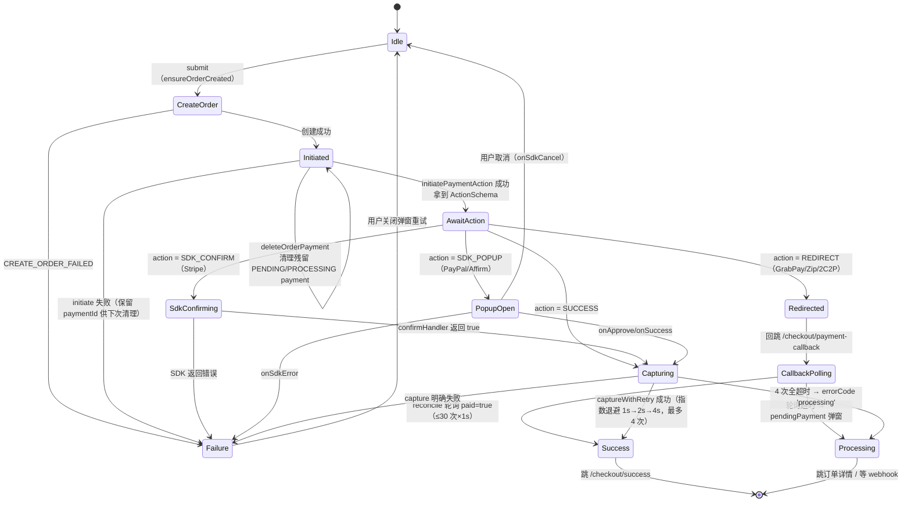

先说结论，`POS payment` 和 `Web payment` 的本质区别不是“支付方式多少”，而是**前端要不要承担交易闭环控制**。

`POS` 里很多支付更像“表单提交 + 后端处理 + 返回结果”，前端主要负责收集信息、提交、展示结果。  
`Web` payment 更像一个**长事务状态机**，因为它要处理：

- 创建订单
- 发起支付
- 调第三方 SDK / 跳转第三方页面
- 用户返回站点
- 再次确认支付结果
- 失败恢复、重复提交、防残留 payment

所以如果你要抽象理解，最重要的一句话是：

**Web payment 不是一个提交动作，而是一条交易状态流。**

**1. 先用最抽象的方式理解这套状态机**

你可以把 web payment 想成 6 个核心状态：

1. `Ready`
用户进入 payment 页面，前端先恢复上下文，比如 orderId、checkout 状态、可用支付方式。

2. `OrderPrepared`
订单已经准备好，或者已恢复出一个可支付订单。

3. `PaymentInitiated`
前端向服务端发起支付初始化，服务端返回“下一步动作”。

4. `UserActionPending`
这一步最关键。根据不同支付商，前端下一步可能是：

- 调 SDK confirm
- 打开 popup
- redirect 到第三方页面

1. `Capturing`
用户动作完成后，系统要做真正的交易闭环确认，也就是 capture / confirm 最终支付状态。

2. `Resolved`
最终进入三种结果之一：

- `Success`
- `Failure`
- `Processing`

**注意**：这三态是语义收敛，不是代码里的单一枚举。真实锚点是：后端支付状态字符串 `PAYMENT_STATUS_PENDING / PROCESSING / PAID`；前端的"三态"是隐式的——success = 跳 success 页，failure = `PaymentErrorCategory` 分类弹窗，processing = capture 全超时返回的字面量 `errorCode: 'processing'` → 归到 `paymentPending` 类别。面试时说"三态"没问题，但被追问"枚举在哪定义"要能讲出这层。

这就是你最应该记住的状态机骨架。

可以把它记成：

`Ready -> OrderPrepared -> PaymentInitiated -> UserActionPending -> Capturing -> Resolved`

**对照代码实现的真实状态转移**（状态名是语义化的，代码里没有单一状态枚举，真实锚点见文末"代码锚点"）：

**2. 为什么 Web 比 POS 难很多**

POS 很多时候是“前端发请求，后端告诉你成功还是失败”，链路短，状态集中在后端。

Web 难在它跨了多个边界：

- 前端页面状态
- 自家服务端状态
- 第三方支付商状态
- 用户浏览器行为状态

尤其是 redirect 型支付，用户会离开你的网站，再回来。  
这时候前端就不能再把 payment 当成“按钮点击后的同步结果”，而必须把它当成“用户可能中断、刷新、返回、重试的一条交易链路”。

所以 web 的难点不是“SDK 难不难接”，而是：

**状态会漂移，前端必须做状态收敛。**

**3. 你们项目里怎么抽象这个问题**

你们这套设计里最值钱的抽象，不是某个 provider 的接法，而是把所有支付商先统一成“动作模型”。

也就是服务端不直接告诉前端“我是 Stripe / GrabPay / Affirm，所以你要写 A、B、C 分支”，而是返回统一动作，比如：

- `SDK_CONFIRM`
- `REDIRECT`
- `SDK_POPUP`
- `SUCCESS`

**代码里的真实形态**（`libs/modules/payment/domain/src/lib/strategies/payment.strategy.ts:119-134`）：`ActionSchema` 是带载荷的判别联合——`SDK_CONFIRM` 带 `clientSecret`、`REDIRECT` 带 `redirectUrl + returnUrl`、`SDK_POPUP` 带 `sdkToken`、`SUCCESS` 只有 `paymentId`。它由 service 层把支付商的 initiate 结果翻译而来，代码注释明确写着 "UI components must not branch on the payment provider type directly"。各支付商的映射：Stripe → `SDK_CONFIRM`，GrabPay / ZipPay / 2C2P → `REDIRECT`，PayPal / Affirm → `SDK_POPUP`——每个支付商一个 Strategy 类，前端主流程只认 action。

这个抽象特别重要，因为它把“支付商差异”翻译成了“前端下一步动作差异”。

这样前端主流程就稳定很多：

1. 先创建或恢复订单
2. 发起 payment initiate
3. 拿到 action schema
4. 根据 action 执行下一步
5. 回到统一 capture 闭环
6. 决定 success / failure / processing

所以从前端角度讲，你可以把支付模块理解成：

**前端不直接对接支付商，而是消费一个统一的交易动作协议。**

**4. Web payment 最核心的状态机，不是 initiate，而是“闭环确认”**

很多人会误以为支付最难的是调 SDK，其实不是。  
最难的是：**用户完成支付动作后，前端怎么知道交易真的结束了。**

因为第三方 SDK 成功，不等于你的订单就真的完成了。  
所以你们项目里后面一定还有一步 `capture` 或 `confirm`，这一步才是交易闭环。

你可以这样理解：

- `initiate` 是“开始付款”
- `SDK / redirect / popup` 是“用户完成支付动作”
- `capture` 才是“系统确认这笔交易最终落账了”

这也是为什么 web payment 一定要有状态机，而不能只写一堆 if else。

**结合代码的两个重要修正（2026-07 核对）：**

1. **capture 只覆盖 SDK / popup 型链路**。代码里 redirect 回跳的 capture 标注为 "reserved, not yet implemented"——redirect 型支付回跳后走的是另一条闭环：`payment-callback` 页轮询 `reconcilePayment`（PUT `/api/v1/order/payment/reconcile`，30 次 × 1s），后端返回 `paid: true` 才是终态。所以更准确的说法是：**SDK/popup 型靠 capture 闭环，redirect 型靠 reconcile 轮询闭环**。
2. **capture 本身有可靠性设计**：`captureWithRetry` 包了超时（5s/次）+ 指数退避（1s→2s→4s，cap 8s，最多 4 次）+ 幂等键（traceId）。4 次全超时不报 failure，而是收敛到 `processing`——因为此时支付到底成没成是未知的，宁可让用户看"处理中"等 webhook，也不能误报失败引发重复支付。

**5. redirect 型支付为什么最麻烦**

这块是 web payment 最值得说的一点。

因为 redirect 型支付会出现这种情况：

1. 用户在你的网站点支付
2. 跳到第三方页面
3. 用户支付完，再跳回来
4. 跳回来时，前端看到的是一个“恢复现场”

这时候前端不能直接相信 URL 上带回来的参数，也不能直接认为失败或成功，而是要：

1. 读取回跳上下文
2. 恢复 payment 页面状态
3. 再向后端确认真实支付状态
4. 再决定停留在 payment、跳 success，还是显示 processing

这个设计思想你一定要会讲，因为它特别体现交易系统思维：

**回跳参数只是线索，不是最终真相。**

**6. 如果再抽象一层，Web payment 本质上是在解决 3 类一致性问题**

这是你面试里很容易加分的一句话。

第一类是一致性：`订单状态` 和 `支付状态` 要一致。  
不能支付成功了但订单还显示未完成。

第二类是一致性：`前端看到的状态` 和 `后端真实状态` 要一致。  
不能前端以为失败了，后端其实已经成功。

第三类是一致性：`用户行为中断后恢复` 仍然要一致。  
比如刷新页面、关闭页面再回来、第三方回跳，这些都不能把状态搞乱。

所以支付状态机的价值，本质上不是“代码好看”，而是：

**让一笔交易在复杂交互下仍然可以被正确收敛。**

**7. 你可以怎么理解你们项目里的主链路**

如果只保留最核心骨架，你可以把它讲成下面这 7 步：

1. 进入 payment 页面，先恢复订单和支付上下文
2. 创建订单，或者确认已有订单还能继续支付
3. 清理上次失败残留的 pending payment
4. 发起支付初始化
5. 服务端返回统一动作模型
6. 前端执行 SDK / popup / redirect
7. 回到 capture 阶段，最终收敛到 success / failure / processing

这个版本已经足够面试，不需要陷到每个 provider 细节里。

**8. 这个状态机设计带来的收益**

你可以直接记 4 个收益：

1. 新支付商接入时，不用重写 payment 页主流程。
2. 前端不会把 provider 差异和页面状态搅在一起。
3. redirect、刷新、回跳、重试这些异常场景更容易处理。
4. observability 更清晰，能知道失败发生在 initiate、用户动作，还是 capture。

**9. 面试里怎么回答**

如果面试官问你“你们 web payment 为什么复杂”，你可以这样答：

“POS 支付很多是表单提交后由后端完成主流程，前端更多是收集信息和展示结果。Web payment 更复杂，因为前端要承接整个交易状态流，尤其是第三方 SDK、redirect 回跳、失败恢复和最终 capture 闭环。  
所以我们不是把 payment 当成一次 submit，而是把它建模成一个交易状态机。主流程可以抽象成：先恢复订单上下文，再 initiate payment，服务端返回统一动作，比如 SDK_CONFIRM、REDIRECT、SDK_POPUP，然后前端执行对应动作，最后再回到 capture 阶段统一收敛成 success、failure 或 processing。  
这个抽象的价值是把支付商差异隔离掉，让 payment 页主流程稳定，也更容易处理刷新、回跳和重试这些复杂场景。”  

如果面试官继续追问“最难的是哪一段”，你就答：

“最难的不是 initiate，而是 redirect 回来之后的状态收敛和 capture 闭环，因为这时候前端看到的只是恢复现场，不一定是真实交易结果。”

## 三个高频追问的完整回答

### 追问 1：为什么一定要有 `ActionSchema` 这种统一动作协议？

因为它解决的是"支付商差异爆炸"问题。我们有 5 个市场、35 个支付方式枚举值（`PaymentMethodProviderEnum`），如果让 payment 页直接感知 Stripe / GrabPay / Affirm 各自的 SDK 调用方式，主流程就是一堆 provider 分支，每接一个新区都要改主流程。

统一动作协议把问题拆成两半：

- **支付商差异**收敛在 Strategy 层（每个支付商一个 Strategy 类，`PaymentStrategyFactory` 按 provider 选）；
- **前端主流程**只认 4 种 action：`SDK_CONFIRM`（带 clientSecret）/ `REDIRECT`（带 redirectUrl）/ `SDK_POPUP`（带 sdkToken）/ `SUCCESS`。

代码里有一条注释把这条规则写死了："UI components must not branch on the payment provider type directly"。新支付商接入 = 新增一个 Strategy + 映射到一个已有 action，payment 页零改动。这就是状态机里 `AwaitAction` 状态只有一个、而出口有四条的原因。

### 追问 2：为什么 `capture` 才是真正的交易闭环？

因为第三方 SDK 返回成功，只代表"用户付了钱"，不代表"你的系统确认了这笔交易"。中间隔着网络、并发、回调时序。所以 SDK/popup 型链路在用户动作完成后，必须再调一次自家后端的 confirm/capture，拿到系统级终态。

工程上还有两个细节让 capture 更像"闭环"而不是"一次请求"：

1. **重试与退避**：`captureWithRetry` 每次 5s 超时，指数退避 1s→2s→4s（cap 8s），最多 4 次，幂等键是 traceId——网络抖动不能直接导致支付失败；
2. **未知态的诚实处理**：4 次全超时后，支付到底成没成是**未知的**——这时候返回的不是 failure 而是 `processing`，让用户看"处理中"页面等 webhook 对账。误报 failure 会引发用户重复支付，这是交易系统最不能犯的错。

所以闭环的本质是：**任何一笔交易都必须收敛到一个确定的终态，哪怕这个终态是"我不知道，先挂着"。**

### 追问 3：redirect / popup / SDK confirm 三种模式在状态机上有什么区别？

核心区别是**前端是否失去对页面的控制权**：

| 模式 | 控制权 | 闭环方式 | 状态机难点 |
| ---- | ------ | -------- | ---------- |
| SDK_CONFIRM（Stripe） | 不离开页面 | confirm 后直接 capture | 最简单，同步链路 |
| SDK_POPUP（PayPal/Affirm） | 页面还在，弹层交互 | 弹层回调（onApprove/onSuccess）后 capture | 要处理用户取消（onSdkCancel → 回 Idle 重试） |
| REDIRECT（GrabPay/Zip/2C2P） | **完全离开站点** | 回跳后 reconcile 轮询（30 次 × 1s，paid=true 才终态） | 最难：用户可能不回来、回来是全新页面加载、回跳参数不可信 |

redirect 的特殊性在于回跳后整个前端状态是重建的——payment-callback 页从 URL 拿 orderId/token，但**只把它当线索**，然后轮询后端 reconcile 接口确认真实状态：paid → 跳 success；30 秒轮询超时 → 弹"处理中"窗口（可跳订单详情）。这个设计背后的原则和 capture 全超时返回 processing 是同一个：**宁可挂起，不可误判**。

## 代码锚点速查（被追问"这在代码里哪"时用）

- `ActionSchema` 定义：`libs/modules/payment/domain/src/lib/strategies/payment.strategy.ts:119-134`
- 支付商 → action 映射：各 Strategy 类（`stripe.strategy.ts` → SDK_CONFIRM；`grabpay/zippay/twoctop.strategy.ts` → REDIRECT；`paypal/affirm.strategy.ts` → SDK_POPUP）
- 主流程编排：`use-payment-execution.ts` 的 `runPaymentPipeline`（ensureOrderCreated → deleteOrderPayment 清残留 → initiate → 按 action 执行 → capture）
- capture 可靠性：`capture-with-retry.ts`（5s 超时、1s→2s→4s 退避、最多 4 次、traceId 幂等）
- redirect 回跳：`apps/web/.../checkout/payment-callback/page.tsx`（reconcile 轮询，provider 白名单 GRABPAY/ZIPPAY/TWO_C2P）
- 支付状态字符串：`PAYMENT_STATUS_PENDING / PROCESSING / PAID`；失败分类：`classify-payment-error.ts`（`PaymentErrorCategory`，含 `paymentPending`）
