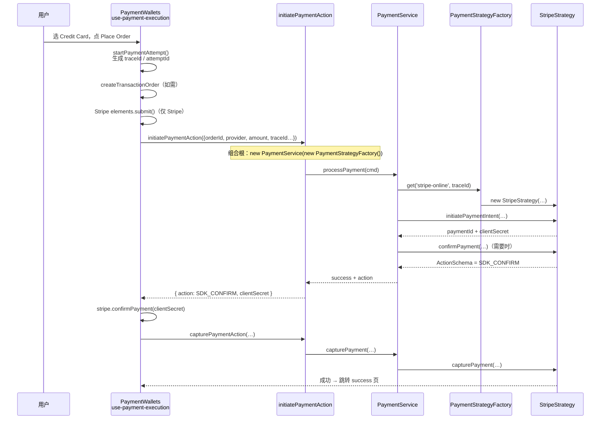
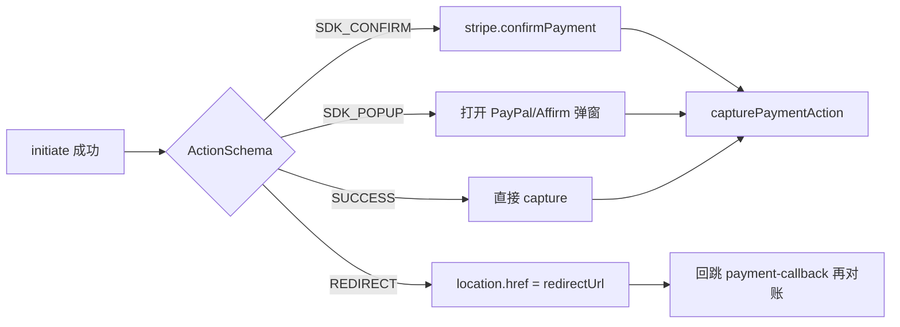
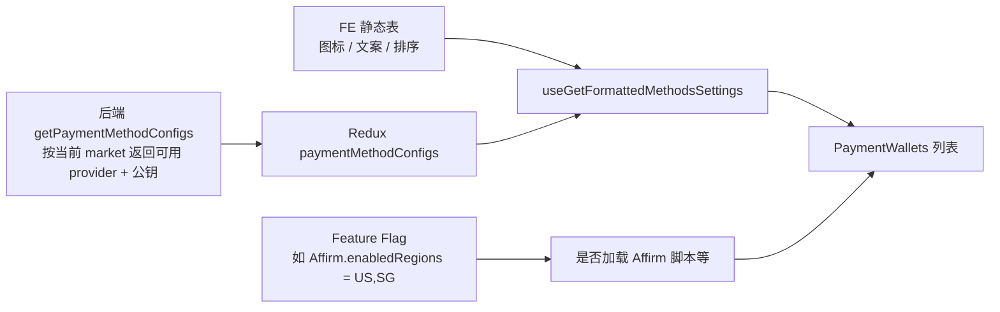
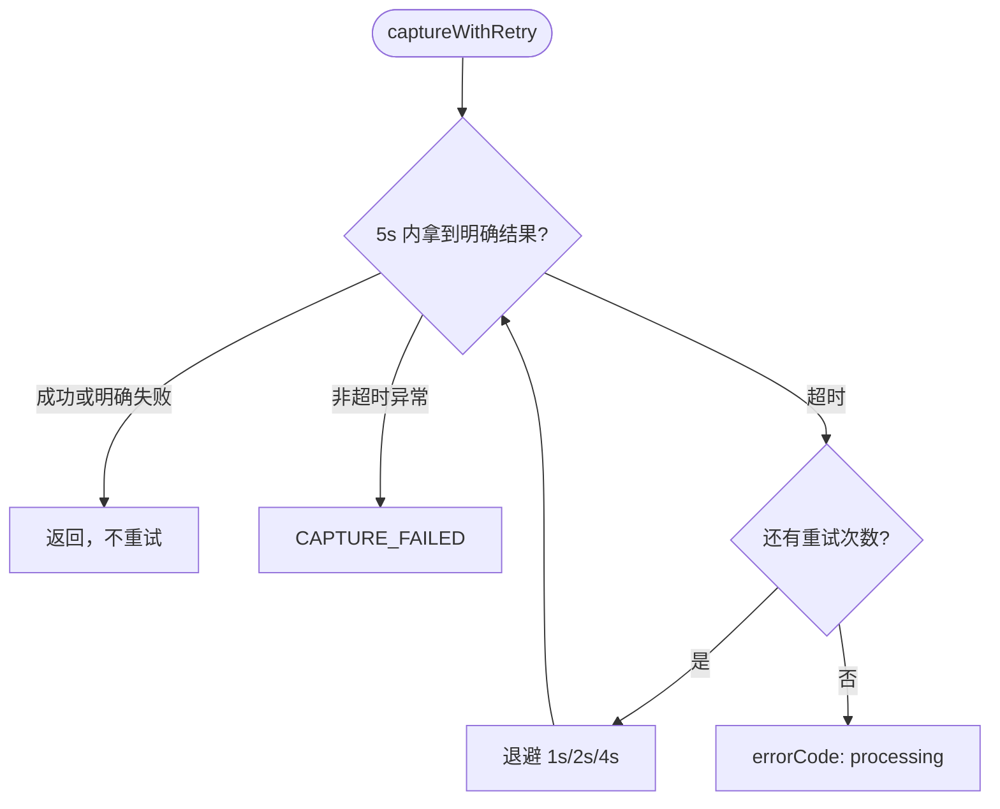

# 支付模块技术方案

> 读前约定：先搞清「谁干什么」，再记文件名。设计模式名词都附带一句人话。

## 1. 要解决什么问题

Payment 不是「接一个 Stripe」那么简单，而是同时面对：

1. **多支付商差异大**：卡支付（SDK 确认）、跳转支付（GrabPay/Zip）、弹窗支付（PayPal/Affirm）流程完全不同。
2. **链路风险高**：创单 → 初始化 → 用户确认 → capture → 回滚，任一步失败都影响转化。
3. **页面容易失控**：若把各家差异全堆在 React 页面里，每加一个支付商都要改主流程，回归爆炸。

目标：主流程稳定、差异可插拔、前后端边界清晰、出问题能定位。

---

## 2. 先看谁干什么（用人话）

把支付想成餐厅：

| 角色（人话） | 代码落点 | 实际干什么 |
| ------------ | -------- | ---------- |
| **点餐员 / 收银员** | `components`（`PaymentWallets`） | 让用户选支付方式、填卡、点按钮；调浏览器 SDK；**不自己编排第三方 API** |
| **前台总台（唯一入口）** | `actions`（`initiatePaymentAction` / `capturePaymentAction`） | 浏览器只认识这两个入口；注入 `traceId`；组装 Service + Factory |
| **厨房主管（编排）** | `services`（`PaymentService`） | 固定步骤：initiate →（可选）confirm → capture / rollback；**不管是 Stripe 还是 PayPal** |
| **各菜系厨师（差异）** | `infrastructure`（`StripeStrategy` 等） | 真正调 Stripe/PayPal/… API |
| **菜单/菜名标准** | `domain`（接口、`ActionSchema`、枚举） | 规定「厨师必须会哪些菜」；前后端约定「下一步做什么」 |

```text
┌─────────────────────────────────────────────────────────────┐
│  components（浏览器）                                         │
│  PaymentWallets → use-payment-execution / SDK 组件           │
│  角色：点餐与收银，只驱动 UI + SDK                             │
└────────────────────────────┬────────────────────────────────┘
                             │ 调 Server Action（唯一业务入口）
                             ▼
┌─────────────────────────────────────────────────────────────┐
│  actions（组合根 / 轻量 BFF）                                  │
│  initiatePaymentAction / capturePaymentAction                │
│  new PaymentService(new PaymentStrategyFactory())            │
│  角色：前台总台，装配依赖、注入 traceId                        │
└────────────────────────────┬────────────────────────────────┘
                             │
                             ▼
┌─────────────────────────────────────────────────────────────┐
│  services（编排）                                             │
│  PaymentService.processPayment / capturePayment              │
│  角色：厨房主管，按统一步骤调度，不碰具体商户 SDK               │
└────────────────────────────┬────────────────────────────────┘
                             │ factory.get(provider, traceId)
                             ▼
┌─────────────────────────────────────────────────────────────┐
│  infrastructure（第三方适配）                                  │
│  Stripe / PayPal / GrabPay / Affirm / Zip / 2C2P Strategy   │
│  角色：各菜系厨师，真正打第三方 API                            │
└─────────────────────────────────────────────────────────────┘
         ▲
         │ 契约来自
┌────────┴────────────────────────────────────────────────────┐
│  domain：IPaymentStrategy / ActionSchema / Provider 枚举      │
│  角色：菜单标准，谁都能看懂的「下一步指令」语言                 │
└─────────────────────────────────────────────────────────────┘
```

**目录**（对应上面角色）：

```text
libs/modules/payment/
├── domain/          # 菜单标准（接口 / ActionSchema / 枚举）
├── infrastructure/  # 各支付商厨师（Strategy + Factory）
├── services/        # 厨房主管（PaymentService）
├── actions/         # 前台总台（Server Action）
└── components/      # 收银柜台（PaymentWallets + hooks）
```

依赖方向：**外层可以用内层，内层不依赖外层细节**。  
`PaymentService` 只依赖「工厂接口」，不 `import` Stripe 实现类。

---

## 3. 一次支付怎么跑（主链路）

以「用户选信用卡」为例：



其它支付商差别主要在 **服务端返回的「下一步指令」**（`ActionSchema`），不是在页面里写死一堆 `if`。

---

## 4. ActionSchema：前后端的统一语言

服务端**不直接操作浏览器**，而是告诉前端「下一步做什么」：

```ts
type ActionSchema =
  | { action: 'SDK_CONFIRM'; clientSecret: string; paymentId: string }
  | { action: 'REDIRECT'; redirectUrl: string; paymentId: string; returnUrl: string }
  | { action: 'SDK_POPUP'; paymentId: string; sdkToken: string }
  | { action: 'SUCCESS'; paymentId: string };
```

| 指令 | 人话 | 典型支付商 |
| ---- | ---- | ---------- |
| `SDK_CONFIRM` | 用浏览器 SDK 再确认一下（常含 3DS） | Stripe 卡 / Express |
| `REDIRECT` | 整页跳到第三方，回来再对账 | GrabPay / Zip / 2C2P |
| `SDK_POPUP` | 弹窗完成授权，回调里再 capture | PayPal / Affirm |
| `SUCCESS` | 没有中间步，直接去 capture | 少数路径 |



---

## 5. 「当前市场第三方支付」怎么来的？

这里最容易混：**Strategy 注册** ≠ **市场能用哪些方式**。

### 5.1 Strategy：代码里写死的「全量厨师名单」（全市场共用）

`PaymentStrategyFactory` 构造时用 Map 登记所有实现：

```ts
// 伪代码：加支付商 = 往 registry 加一行
registry.set(STRIPE_ONLINE, (traceId) => new StripeStrategy(...));
registry.set(PAYPAL_ONLINE, (traceId) => new PaypalStrategy(traceId));
registry.set(AFFIRM, (traceId) => new AffirmStrategy(traceId));
// …
```

- **不是**按市场动态注册  
- 每次 Action 里 `new PaymentStrategyFactory()`，名单都一样  
- 运行时只做：`factory.get(用户选的 provider)`

### 5.2 市场可用性：后端配置 + Feature Flag 决定「菜单上有什么」



| 层 | 作用 |
| -- | ---- |
| 后端 configs | **主开关**：这个国家开不开 GrabPay / Zip / Affirm… |
| Feature Flag（`monorepo-features`） | 前端能力开关，如 Affirm 脚本是否注入 |
| 静态 settings | 展示用（label、icon、trackingLabel） |
| Factory Map | 技术实现随时可实例化；用户选不到就不会走到 |

**一句话**：US/SG/AU 的 factory 代码相同；差别在「列表里有没有这个选项」。

---

## 6. 设计模式（先人话，再对号入座）

不必先背名词。对应关系：

| 模式名 | 人话 | 在本模块里 |
| ------ | ---- | ---------- |
| **策略 Strategy** | 同一道工序，换不同厨师做 | `IPaymentStrategy` + 各 `*Strategy` |
| **工厂 Factory** | 按菜名点厨师，不自己满厨房找 | `PaymentStrategyFactory.get(provider)` |
| **依赖倒置 DIP** | 主管只认「厨师工会接口」，不认张三李四 | Service → `IPaymentStrategyFactory` 接口 |
| **组合根** | 只有大门处才把真厨师名单塞进主管手里 | `payment.action.ts` 里 `new PaymentService(new Factory())` |
| **门面 / BFF** | 顾客只跟总台说话，不进后厨 | 浏览器只调两个 Server Action |
| **状态指令** | 厨房纸条写「下一步：去弹窗/去跳转」 | `ActionSchema` |

为什么值得这样做：变化集中在 Strategy；主流程可测、可观测；换支付商主要是「加厨师 + 开菜单」，不是改厨房主管。

---

## 7. 提交流程步骤（实现视角）

```text
1. （Stripe）elements.submit()     客户端表单校验
2. createTransactionOrder()         客户端 RTK 创单（错误走 checkout 既有 listener）
3. deleteOrderPayment()             清上次失败残留 pending
4. initiatePaymentAction()
     → PaymentService.processPayment()
     → Strategy.initiatePaymentIntent() / confirmPayment()
     → 返回 ActionSchema
5. 按 ActionSchema 执行客户端动作
6. capturePaymentAction()（常包一层 captureWithRetry）
7. 跳转 /checkout-success
```

### 为什么 createOrder 仍在客户端？

创单错误码很多，且已被 checkout 的 listener / modal 体系消费。若硬塞进 Server Action，会压扁成通用 payment error，损失提示能力。  
边界划分：**创单错误 → checkout 域；支付初始化/确认 → Action + Strategy**。

---

## 8. 支付商接入矩阵（现状）

Factory 已注册：Stripe 系列（Online / Afterpay / Affirm-via-Stripe / Apple / Google / Link）、PayPal、GrabPay、2C2P、ZipPay、Affirm。

| 支付商 | 返回动作 | 页面侧 | 状态 |
| ------ | -------- | ------ | ---- |
| Stripe 系列 | `SDK_CONFIRM` | PaymentElement + confirm | 已贯通 |
| GrabPay / Zip | `REDIRECT` | 跳转 + `/checkout/payment-callback` | 已贯通 |
| PayPal / Affirm | `SDK_POPUP` | 弹窗 + capture 回调 | 已贯通 |
| 2C2P | `REDIRECT` | handler 预留，端到端待联调 | 未闭环 |

---

## 9. 状态恢复与容错（工程要点）

- **订单恢复**：searchParams / session persistence，避免刷新重复创单  
- **Pending 清理**：再发起前删掉上次失败残留 payment  
- **倒计时**：以订单 `paymentExpiredAt` 为准  
- **Capture 重试**：客户端 `captureWithRetry`（约 5s × 最多 4 次，指数退避）；幂等键复用 `traceId`



---

## 10. 架构收益（压缩版）

- **扩**：新支付商 ≈ 新 Strategy + Factory 注册 +（后端）开 configs  
- **稳**：主流程骨架不变，差异局部化  
- **安**：敏感编排在服务端；浏览器只做 SDK 与交互  
- **查**：按 create / initiate / SDK / capture / rollback 分段 + `txn_trace_id`  

仍需收敛：2C2P 端到端、部分回调页观测盲区、文档与代码持续对齐。

---

## 11. 相关文档

- [33.payment-wallets.md](./33.payment-wallets.md) — 支付页组件与 hooks  
- [34.设计模式结合Joyboy.md](./34.设计模式结合Joyboy.md) — 模式与面试口述  
- Joyboy 源码：`libs/modules/payment/**` · 仓库 ai-spec：`docs/ai-specs/payment/`
