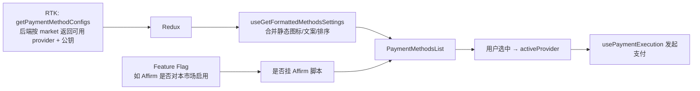
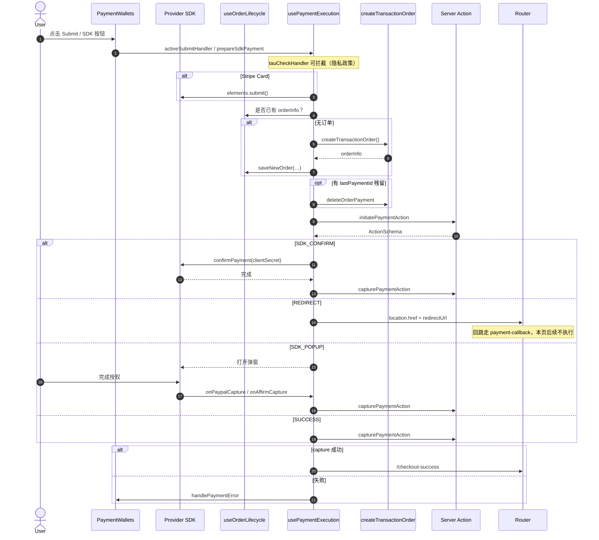
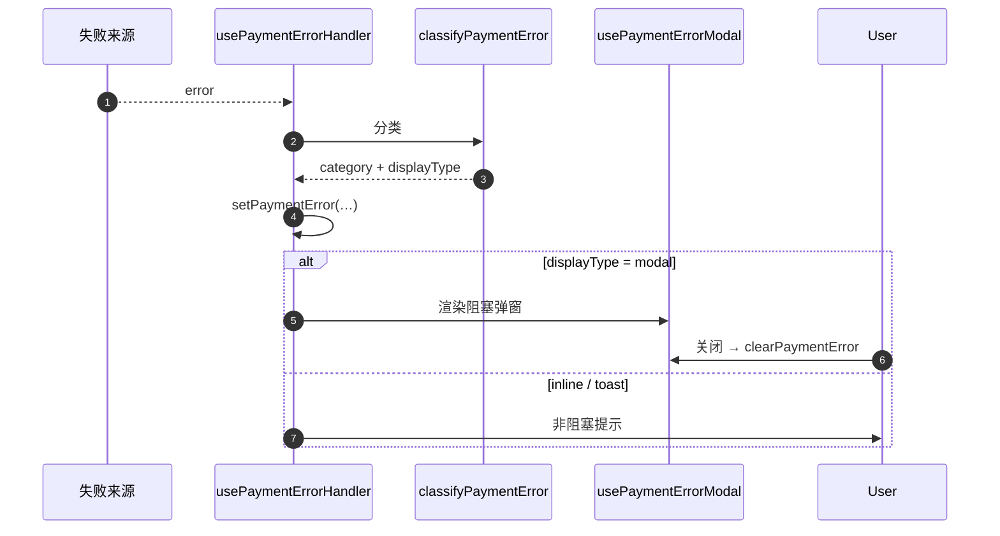

# PaymentWallets 技术实现方案

> `PaymentWallets` = 支付页的「收银柜台」。它负责展示与连线；真正打第三方 API 的是 Server Action → PaymentService → Strategy（见 [32](./32.payment-tech-solution.md)）。

## 1. 它是干什么的

在 checkout / orderCheckout 支付页里，这个组件负责：

- 渲染**当前市场可用**的支付方式列表  
- 承接「选方式 → 填表单 → 提交」交互  
- 把浏览器 SDK（Stripe / PayPal / Affirm…）和 Server Action **串成一条管道**  
- 统一订单生命周期、错误展示、过期倒计时、埋点  

原则：**组件尽量薄，逻辑沉到 hook** —— 组件只「连线 + 渲染」。

---

## 2. 角色分工（先看这张）

```text
PaymentWallets（柜台外观）
  │
  ├── usePaymentMethodSelection   「菜单与选中态」
  │     显示哪些方式、当前选中谁、Express 优先级
  │
  ├── useOrderLifecycle           「订单本」
  │     有没有单、从哪恢复、pending 支付、写 sessionStorage
  │
  ├── usePaymentExecution         「收银流水线」
  │     initiate → 按 ActionSchema 分支 → capture；各方式 submit handler
  │
  ├── usePaymentCountdown         「订单过期倒计时」
  ├── usePaymentErrorHandler      「错误分类 → setPaymentError」
  ├── usePaymentErrorMessages     「i18n 文案」
  └── usePaymentErrorModal        「弹窗展示」
```

| Hook / 模块 | 人话角色 | 你改它的时候通常在改什么 |
| ----------- | -------- | ------------------------ |
| `PaymentWallets` | 柜台布局 | JSX 结构、把 handler 传给子组件 |
| `usePaymentMethodSelection` | 菜单员 | 默认选中、可见列表、Express 只露一个入口 |
| `useOrderLifecycle` | 订单本 | 创单前后状态、残留 paymentId、双路径 checkout vs orderCheckout |
| `usePaymentExecution` | 收银主管 | 整条支付管道、各 provider 的 submit / capture |
| 错误相关 hooks | 客服台 | 分类、文案、modal / inline / toast |

### 子组件（纯展示居多）

- `PaymentWalletsHeader` — 标题与安全标识  
- `PaymentMethodsList` — 支付方式列表  
- `PaymentSubmitSection` — 底部提交区（submit / express / sdk / inlineError 插槽）  
- `PaymentWalletsSkeleton` — configs 加载中  

### SDK Element（浏览器里的「刷卡机」）

- `StripePaymentElement` / `ExpressCheckoutElement`  
- `PaypalPaymentElement` / Affirm JS SDK  

---

## 3. 当前市场「菜单」怎么来的

支付页打开后，并不是把 factory 里所有 Strategy 都画出来，而是：



- **后端 configs**：这个国家开哪些支付（主开关）  
- **Feature Flag**：前端是否加载对应 SDK  
- **Factory**：用户点了才会在服务端 `get(provider)`；菜单上没有就不会走到  

详见 [32 §5](./32.payment-tech-solution.md)。

---

## 4. 核心流水线（Phase 5）

思想：**UI 只驱动 SDK；编排在 Server Action**。

```text
1. elements.submit()           仅 Stripe：客户端表单校验
2. createTransactionOrder()    RTK 创单（错误走 checkout listener）
3. initiatePaymentAction()     Server Action → 返回 ActionSchema
4. 按 ActionSchema：
     SDK_CONFIRM → stripe.confirmPayment
     REDIRECT    → location.href = redirectUrl
     SDK_POPUP   → 弹窗，回调里 capture（PayPal / Affirm）
     SUCCESS     → 直接第 5 步
5. capturePaymentAction()      常包 captureWithRetry
6. → /checkout-success
```

### 4.1 完整时序（三分支汇总）



### 4.2 错误处理时序



分类细则见同目录错误对照表（若有）。

---

## 5. 三个核心 Hook（展开）

### 5.1 `useOrderLifecycle` — 订单本

管：`orderInfo`、是否已有终态支付、`lastPaymentIdRef`（给 cleanup 用）。

| 行为 | 说明 |
| ---- | ---- |
| mount | orderCheckout 从 dataSource 恢复；检查 getOrderPayments |
| 已有终态支付 | 常 redirect 到订单历史 |
| PENDING 残留 | 记下 paymentId，下次发起前 delete |
| saveNewOrder | checkout 创单成功后写 state + sessionStorage |

双路径：

- **checkout**：主动创单 → 写 sessionStorage  
- **orderCheckout**：恢复已有单 → 一般不写 sessionStorage  

### 5.2 `usePaymentExecution` — 收银流水线

对外提供各方式的 submit / capture handler；对内共用：

| 内部函数 | 作用 |
| -------- | ---- |
| `startPaymentAttempt` | 生成 `traceId` / `attemptId`（观测伞状 ID） |
| `buildOrderAndInitiate` | 确保有单 → 清 stale payment → `initiatePaymentAction` |
| `runPaymentPipeline` | 按 ActionSchema 跑 SDK_CONFIRM / REDIRECT / SUCCESS |
| `prepareSdkPayment` | PayPal / Affirm 弹窗前的前置 initiate |
| `captureWithRetry` | capture 网络抖动重试 |

`buildClientContext(step)` 会带上 `traceIdRef.current`，所以 Sentry / 交易日志里的 `txn_trace_id` 来自这里（见支付观测文档）。

### 5.3 `usePaymentMethodSelection` — 菜单员

- 默认选中：优先 props，否则 Credit Card（Stripe Online）  
- Express：设备能力上报后，Apple > Google > Link 只露一个入口  
- `visibleMethods`：过滤不支持的 Express  
- 选中时埋点（常 `skipSentry: true`，只做交易日志）  

---

## 6. 各支付方式怎么点到提交

| 方式 | Element | 提交入口 | 人话 |
| ---- | ------- | -------- | ---- |
| Stripe Card | PaymentElement | `onStripeCardSubmit` | 页内表单 + Place Order |
| GrabPay / 2C2P | 无 | `onGrabPaySubmit` / `onTwoCTwoPSubmit` | 点按钮就走 REDIRECT |
| PayPal | Paypal Element | SDK 按钮 → `onPaypalCapture` | 弹窗授权 |
| Affirm | Affirm JS | 页内 Submit → 弹窗 → `onAffirmCapture` | 弹窗 BNPL |
| Express | ExpressCheckoutElement | Element 自带按钮 | 钱包一键 |

`activeSubmitHandler` 按 `isXxxSelected` 选用，并先发 `placeOrderClickedEvent`。

---

## 7. 状态与错误展示

```ts
type PaymentState = {
  error: PaymentError | null;
  isProcessing: boolean;
  isReadyToSubmit: boolean;
};
```

| displayType | 表现 |
| ----------- | ---- |
| `inline` | 表单下文字，不挡操作 |
| `toast` | 短暂提示 |
| `modal` | 必须关掉的阻塞弹窗 |

过期有两条路汇合：前端倒计时归零；或后端 `ORDER_EXPIRED`。

---

## 8. 几个易踩坑的设计点

### 8.1 Stripe Keep-Mounted

切到别的支付方式时，Stripe DOM **不卸载**，只 `display: none`，避免用户填的卡号丢失。

### 8.2 ResumeState

从失败页 / magic link 回来时可带 `resumeState`：`processing` 显示等待文案；`failure` 走完整错误分类。

### 8.3 Ref 稳定化

Express Element 创建贵，用 ref + 稳定 callback，避免父组件重渲染把钱包按钮拆掉重建。

### 8.4 Tracking（禁止组件直调渠道 SDK）

- 选支付方式 / Place Order / capture 成功 → 发领域事件  
- tracking listener 再映射到 GA 等（见 AGENTS Tracking 规则）  

---

## 9. 和 32 文档怎么分工

| 问题 | 看哪篇 |
| ---- | ------ |
| 五层架构、Service、Factory、市场 vs 注册 | [32](./32.payment-tech-solution.md) |
| 支付页 hooks、时序、错误 UI、各方式入口 | **本文** |
| 策略/工厂等模式面试口述 | [34](./34.设计模式结合Joyboy.md) |
