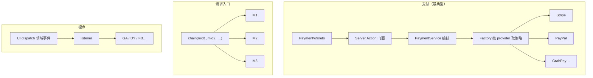
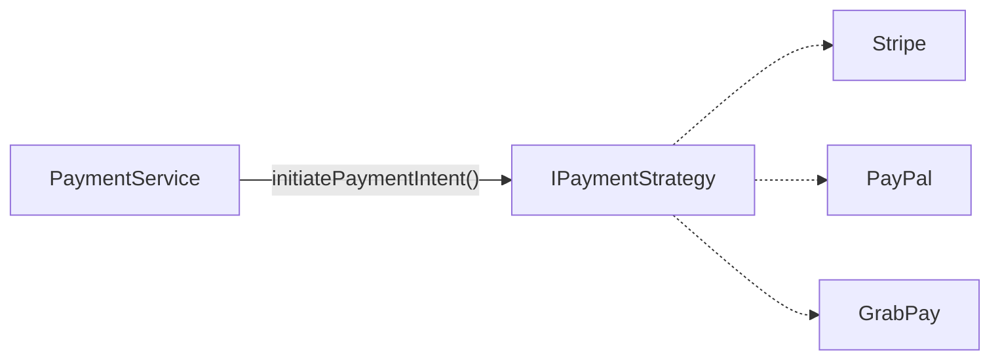
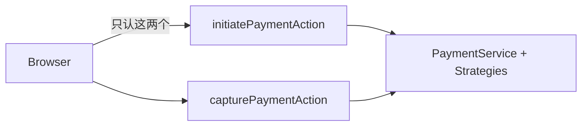
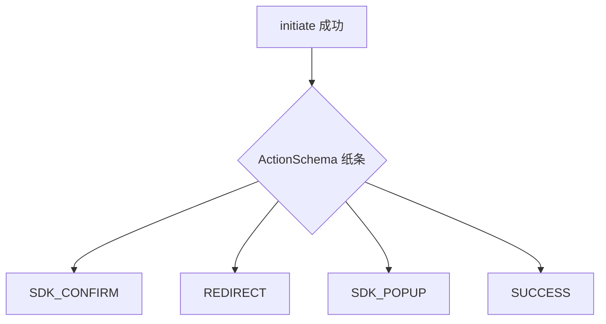

# Joyboy 设计模式笔记（结合真实实现）

> 目标：能讲清「解决什么痛 → 项目里谁扮演什么 → 代价是什么」。  
> **先读人话，再记模式名。**  
> 深读：[32.payment-tech-solution](./32.payment-tech-solution.md) · [33.payment-wallets](./33.payment-wallets.md)

---

## 〇、先别背名词：一张地图

| 你遇到的痛 | 人话做法 | 模式名（可后记） | Joyboy 落点 |
| ---------- | -------- | ---------------- | ----------- |
| 多支付商流程差很多，怕 if-else 堆爆 | 同一套步骤，换不同「厨师」 | 策略 | `*Strategy` |
| 不想在业务里到处 `new Stripe…` | 按名字点厨师 | 工厂 | `PaymentStrategyFactory` |
| 编排层不能绑死 Stripe | 主管只认接口，真厨师外层塞进来 | DIP + 组合根 | Service ↔ 接口；Action 里装配 |
| 浏览器不该碰后厨细节 | 只留两个柜台窗口 | 门面 / BFF | Server Action |
| 请求入口一堆正交逻辑 | 排队过安检，每关可拦可放行 | 责任链 | `middleware/chain` |
| 埋点渠道多，UI 不该 import GA | 业务喊一声，别人去广播 | 观察者 | tracking listener |
| 两套数据源，一套 UI | 中间翻译一层 | 适配器 | coupon / searchClient |
| 配置必须全站一份 | 全局唯一取数点 | 单例 | `FeatureManager` |
| 一次业务意图可追踪 | 把「做某事」封成可 dispatch 对象 | 命令 | `*Command` thunk |
| 服务端告诉前端下一步 | 纸条指令，不要布尔旗海 | 状态指令 | `ActionSchema` |



---

## 1. 策略模式 — 「换厨师，不换工序」

### 人话

做菜步骤都是：备料 → 下锅 → 出餐。  
川菜、粤菜手艺不同，但不能每来一道菜就改整间厨房的流程表。

支付也一样：initiate →（可选确认）→ capture 骨架不变；变的是 Stripe / PayPal / GrabPay 怎么调 API。

### 项目里谁扮演什么

| 角色 | 是谁 |
| ---- | ---- |
| 工序表 | `PaymentService`（只调统一方法） |
| 厨师工会标准 | `IPaymentStrategy` |
| 各菜系厨师 | `StripeStrategy`、`PaypalStrategy`、`AffirmStrategy`… |



### 为什么适合 / 代价

- **适合**：变化在「算法」，不在「骨架」  
- **代价**：类变多；接口抽象错了会全家跟着改（项目用可选 Trait：`IConfirmPayment` 等，避免深继承）

### 面试一句

"支付适合策略：骨架一样，差异封进 Strategy。Service 只依赖接口，加商户主要是加实现，不是改主链路 if-else。"

---

## 2. 工厂 + 注册表 — 「按名字点厨师」

### 人话

主管不说「去后厨找张三」，而说「给我做 Stripe 的那位」。  
名单贴在门口一张表上：加新人就加一行。

### 项目里

```ts
// PaymentStrategyFactory：Map<provider, () => Strategy>
factory.get('stripe-online', traceId) → new StripeStrategy(...)
```

**注意**：这张表是**全市场共用、代码写死**的；  
「当前市场菜单上有没有 Affirm」由后端 configs + Feature Flag 决定，不是 factory 按国家动态注册。  
（详见 [32 §5](./32.payment-tech-solution.md)）

同类还有按国家取订单特性的 `MarketFactory`，以及 `makeStore()` 这类工厂函数。

### 面试一句

"策略管行为差异，工厂按 provider 取出策略。注册表一眼能看见有哪些实现；Service 不散落 new。"

---

## 3. 依赖倒置（DIP）+ 组合根 — 「主管认工会，不认张三」

### DIP 人话

- 高层（编排）**不要**直接 `import StripeStrategy`  
- 两边都依赖**抽象**（接口）  
- 「倒置」= 不是业务去贴实现，而是实现来符合业务定的接口  

```text
❌ Service → 直接 new StripeStrategy
✅ Service → IPaymentStrategyFactory ← Stripe 实现
   只有 Action（大门）把两边捏在一起
```

### 组合根人话

只有「店门口」才允许写 `new PaymentService(new PaymentStrategyFactory())`，  
避免业务代码到处装配，也避免 services 依赖 infrastructure（Nx 边界）。

### 面试一句

"Service 依赖工厂接口，具体 Factory 在 Server Action 装配。加 PayPal 不会倒逼改 Service 的 import 图。"

---

## 4. 门面 / 轻量 BFF — 「顾客只跟总台说话」

### 人话

浏览器只调：

- `initiatePaymentAction`
- `capturePaymentAction`

入口里面：注入 `traceId`、错误兜底、调 `PaymentService`、挡住各家差异。  
不是另起一个微服务，而是同仓 Server Action 当「为前端定制的后厨窗口」。



### 面试一句

"对前端支付就两个 Action，这是门面；同时扮演轻量 BFF，页面不直连多家后端编排。"

---

## 5. 责任链 — Middleware「安检流水线」

### 人话

进站要过安检：护照 → 安检仪 → 抽查。每一关可处理、改写行李（cookies/headers），也可直接拦下。

```ts
chain([cors, paramResolver, geoLocation, countrySelect, …])
```

每个中间件是「接收 next 的工厂」，顺序敏感。

### 面试一句

"Next middleware 做成责任链：区域纠正、geo、rewrite 各自一块，比单文件巨型 if 好维护。"

---

## 6. 观察者 — Tracking「业务喊一声，渠道去广播」

### 人话 / 硬规则

```text
UI → dispatch 领域事件（本模块定义）
   → tracking listener 订阅
   → trigger → GA / DY / FB…
```

**禁止**：组件里直接 import trigger、手搓 `_event: trackEvent`。

### 为什么

埋点渠道多、常变；同一「加购成功」可扇出多渠道而不改 cart UI。

### 面试一句

"埋点是观察者：业务只发领域事件，tracking 订阅再映射。换渠道不会穿透到每个按钮。"

---

## 7. 适配器 — 「翻译官」

### 人话

UI 只认一种普通话；cart / checkout 两套方言 → `useCouponWalletAdapter` 翻译。  
InstantSearch 以为在跟 Algolia 说话，实际 `searchClient` 适配到自建 ES。

### 面试一句

"适配器抹平数据源差异，保住 UI 契约；搜索还实现 responsesCache 满足 SSR hydrate。"

---

## 8. 单例 — 「全站只准有一份配置本」

`FeatureManager.getInstance()`、部分鉴权服务。  
**优点**：一致；**代价**：测试难、SSR 小心串请求。搜索等场景故意提供 `createSearchClient()` 避免错误共享。

---

## 9. 命令 — 「把一次意图写成可 dispatch 的令」

`initCheckoutCommand`、`preInventoryReserveCommand`…  
UI/listener `dispatch(command)`，便于 matcher 订阅、复用、追踪。

---

## 10. 状态指令 — ActionSchema「厨房纸条」

服务端不操作浏览器，只下发：

| 纸条 | 前端执行 |
| ---- | -------- |
| `SDK_CONFIRM` | `confirmPayment` |
| `REDIRECT` | 整页跳转 |
| `SDK_POPUP` | 弹窗 |
| `SUCCESS` | 直接 capture |

这比页面里一堆 `isStripe && !isRedirect && …` 稳。



---

## 11. 怎么选模式（加分口径）

1. **变化点在哪？** 算法 → 策略；创建 → 工厂；子系统太复杂 → 门面；多步可插拔 → 责任链；一对多通知 → 观察者；接口不合 → 适配器。  
2. **不这样做的痛说得清吗？** 说不清就别硬套。  
3. **代价能否接受？** 类爆炸、全局状态、链路顺序、事件风暴——主动承认。

**反例**：一个支付商却上完整 Strategy+Factory+DIP；随便单例导致 SSR 串状态；UI 既发事件又直调 trigger。

---

## 12. 60 秒串讲

"Joyboy 里模式是问题驱动的。支付多商户用策略隔离差异，工厂按 provider 取实现，Service 依赖接口，Server Action 当门面和组合根。市场能用哪些支付看后端 configs 和 Feature Flag，不是 factory 按国家注册。请求入口用 middleware 责任链。埋点用领域事件加 listener。优惠券和搜索用适配器。Feature 用单例。业务操作做成 Command 风格 thunk，支付用 ActionSchema 当下一步指令。每个模式我都能说清避免了什么耦合，以及多出来的抽象成本。"

---

## 13. 代码索引

| 主题 | 路径 |
| ---- | ---- |
| Strategy / Factory / Service / Action | `libs/modules/payment/domain\|infrastructure\|services\|actions` |
| 支付页管道 | `…/payment-wallets/hooks/use-payment-execution.ts` |
| Middleware 链 | `apps/web/middleware/lib/chain.ts` |
| Tracking listener | `libs/modules/tracking/services/src/lib/listeners/` |
| Feature 单例 | `packages/monorepo-features/.../feature-manager.ts` |
| 方案长文 | [32](./32.payment-tech-solution.md) · [33](./33.payment-wallets.md) |
