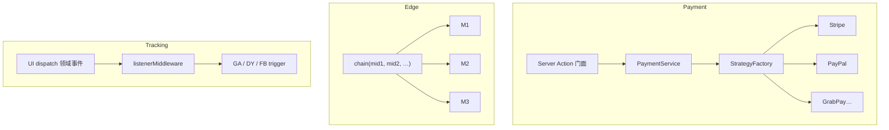

# Joyboy 设计模式笔记（结合真实实现）

> 基于 Joyboy 代码路径整理。定位：面试能讲清「用了什么 → 为什么适合 → 代价是什么」。  
> 体例：每个模式 = 一句话定义 + 项目落点 + 为什么适合 + 优缺点 + 面试口述。  
> 相关深读：[9.Checkout-Payment](./9.Checkout-Payment.md) · [32.payment-tech-solution](./32.payment-tech-solution.md) · [23.RTKQuery+Listener](./23.RTKQuery+Listener.md) · [30.埋点](./30.埋点、FeatureFlag、隐私.md)

**一句话总览**：Payment 用策略 + 工厂 + DIP；请求入口用中间件责任链；埋点用观察者；跨源 UI 用适配器；跨模块配置用单例；支付动作用命令 + 状态指令。

**DIP = Dependency Inversion Principle（依赖倒置原则）**，SOLID 里的 D。

1. **高层模块不应依赖低层模块，两者都应依赖抽象。**  
2. **抽象不应依赖细节，细节应依赖抽象。**

「倒置」的是依赖方向：不是业务编排去 `import` Stripe 实现，而是编排只认接口，Stripe 去实现接口。

## 用支付举例

| 角色 | 谁 | 依赖谁 |
| ---- | -- | ------ |
| 高层 | `PaymentService`（编排 initiate/capture） | 只依赖 `IPaymentStrategyFactory` **接口** |
| 抽象 | `IPaymentStrategy` / `IPaymentStrategyFactory` | 不依赖 Stripe/PayPal |
| 低层细节 | `StripeStrategy`、`PaymentStrategyFactory` | 实现上述接口 |
| 组合根 | `payment.action.ts` | `new PaymentService(new PaymentStrategyFactory())` 把两边捏在一起 |

```text
❌ 依赖「正」着：Service → 直接 new StripeStrategy
✅ 依赖「倒」着：Service → 接口 ← StripeStrategy
                 Action 在边界装配
```

- **DIP**：依赖方向的原则（该依赖谁）  
- **策略模式**：多种可替换算法（行为怎么拆）  
- **工厂**：按 key 创建策略（对象怎么造）  
- **接口/抽象**：DIP 落地的载体  

策略 + 工厂常常一起用，但 **DIP 强调的是「高层不绑死具体类」**。

"DIP 就是让核心流程依赖接口而不是依赖 Stripe 这种细节；具体实现由外层装配进来。这样换支付商或写单测时，不用改 Service 的 import 和主逻辑。"

---

## 〇、模式地图（先别背名词）

| 模式 | 项目主战场 | 解决的痛 |
| ---- | ---------- | -------- |
| 策略 Strategy | Payment Provider | 多支付商差异大，不能 if-else 堆主流程 |
| 工厂 Factory | PaymentStrategyFactory / MarketFactory | 「按类型造对象」集中注册 |
| 依赖倒置 DIP | PaymentService ↔ IPaymentStrategyFactory | 编排层不绑具体实现 |
| 门面 Facade / BFF | Server Action | 浏览器只认两个入口 |
| 责任链 CoR | middleware `chain()` | 多步请求预处理可插拔 |
| 观察者 Observer | tracking listener | UI 不直调埋点 SDK |
| 适配器 Adapter | coupon wallet / searchClient | 两套数据源、一套 UI 契约 |
| 单例 Singleton | FeatureManager / PosUmsAuth | 进程内唯一配置/会话源 |
| 命令 Command | `*Command` thunk | 一次业务操作可 dispatch |
| 状态指令 | ActionSchema | 服务端告诉前端「下一步做什么」 |



---

## 1. 策略模式（Strategy）— Payment 主场

**一句话**：同一接口，多种算法可互换；调用方只依赖接口。

**解释版本**

支付商差异巨大：Stripe 要 `confirmPayment`，GrabPay/Zip 要整页跳转，PayPal/Affirm 要弹窗。若在页面里写 `if (provider === 'stripe') …`，每加一个支付商就改主流程，回归面爆炸。

项目做法：

- `domain` 定义 `IPaymentStrategy`（initiate / capture / remove…）
- `infrastructure` 各写一个 Strategy：`StripeStrategy`、`PaypalStrategy`、`GrabPayStrategy`…
- `PaymentService` 只拿策略对象调统一方法，不感知具体商户细节

```
代码路径：
├── domain/.../payment.strategy.ts          → IPaymentStrategy
├── infrastructure/.../strategies/*.ts      → 各 Provider 实现
└── services/.../payment.service.server.ts  → 编排，只调接口
```

**为什么适合**

- 变化维度清晰：**算法变、流程骨架不变**（下单 → initiate → 客户端动作 → capture）
- 扩展以「新增类」为主，符合开闭原则

**优点**

- 主流程稳定；支付商隔离；单测可 mock 策略

**缺点 / 代价**

- 类数量增加；接口设计要提前抽象（抽象错了所有策略都要改）
- 共享逻辑若乱塞基类，会变成继承泥潭（项目用 Trait 接口如 `IConfirmPayment` 做可选能力，比深继承更稳）

**面试回答版本**

"支付天然适合策略模式：流程骨架一样，差异在初始化参数、确认方式和回调。我们把差异封进 Strategy，Service 只依赖接口。新增支付商主要是加实现和注册，而不是改主链路的 if-else。"

---

## 2. 工厂模式（Factory）+ 注册表

**一句话**：把「怎么 new」从业务代码里抽走，按 key 集中创建。

**解释版本**

### PaymentStrategyFactory

```ts
// libs/modules/payment/infrastructure/.../payment-strategy-factory.ts
export class PaymentStrategyFactory implements IPaymentStrategyFactory {
  private readonly registry: Map<PaymentMethodProviderEnum, StrategyCreator>;
  get(provider, traceId) {
    const factory = this.registry.get(provider);
    if (!factory) throw ...;
    return factory(traceId);
  }
}
```

注释写明：**加支付商只注册这里，其它代码不用改。**

### MarketFactory

```ts
// libs/modules/order/services/src/order-feature.helper.ts
class MarketFactory {
  static getMarket(market) {
    switch (market) {
      case 'SG': return SGMarket;
      case 'US': return USMarket;
      // ...
    }
  }
}
```

按部署国家返回订单侧市场特性对象（与 Feature Flag 互补）。

### 工厂函数

`makeStore()`、`makePersistenceHandles({ cookies })`、`createSearchClient()`：不是 GoF 类工厂，但是同一意图——**可控创建 + 可测隔离**。

**为什么适合**

- 创建逻辑与使用逻辑分离；注册表让「有哪些实现」一眼可见

**优点**

- 装配点单一；易加 mock；避免 Service 里散落 `new XxxStrategy`

**缺点**

- 工厂本身可能变成「大 switch / 大 Map」；要配合 DI/组合根，否则到处 `new Factory()`

**面试回答版本**

"策略负责行为差异，工厂负责按 provider 取出策略。我们用 registry Map，加商户就是加一条注册。Service 构造注入工厂接口，具体 Factory 在 Server Action 组合根里 new。"

---

## 3. 依赖倒置（DIP）+ 组合根

**一句话**：高层依赖抽象；在边界把抽象和实现捏在一起。

**解释版本**

- `PaymentService` 构造函数：`constructor(private factory: IPaymentStrategyFactory)`
- 具体 `PaymentStrategyFactory` 在 **actions** 层实例化：

```ts
const service = new PaymentService(new PaymentStrategyFactory());
```

这样 `services` **不依赖** `infrastructure`（Nx/整洁架构边界），避免「编排层直接 import Stripe」。

文档定位：`actions` = 组合根（Composition Root）。

**为什么适合**

- 支付要测编排、要换实现、要防基础设施泄漏进核心流程

**优点**

- 可测、可替换、边界清晰

**缺点**

- 接口 + 装配多一层心智；小项目会显得「过度设计」（支付这种高差异场景通常值得）

**面试回答版本**

"我们不是为了接口而接口：Service 依赖工厂接口，Stripe 实现落在 infrastructure，Action 做装配。这样加 PayPal 不会倒逼改 Service 的 import 图。"

---

## 4. 门面（Facade）/ 轻量 BFF

**一句话**：给复杂子系统一个简单入口。

**解释版本**

浏览器只调：

- `initiatePaymentAction`
- `capturePaymentAction`

入口内：注入 `traceId`、错误兜底、调 `PaymentService`、屏蔽 provider 细节。文档称之为 **BFF 入口**——不是独立微服务，而是同仓 Server Action 充当「为前端定制的后端门面」。

**为什么适合**

- 支付既要浏览器 SDK，又要服务端安全编排；不能把密钥与编排摊在页面组件

**优点**

- 前端 API 面极小；安全与观测收口；页面复杂度下降

**缺点**

- Server Action 边界要划清（例如 createOrder 是否进 Action：项目刻意有的留在客户端链路，避免错误语义被压扁）

**面试回答版本**

"对前端来说支付就两个 Action，这是门面。后面策略、工厂、第三方 API 都被挡住。它同时扮演轻量 BFF：为支付页收敛调用，而不是让页面直连多个后端。"

---

## 5. 责任链（Chain of Responsibility）— Middleware

**一句话**：请求沿链传递，每环可处理、改写或中断。

**解释版本**

```ts
// apps/web/middleware/lib/chain.ts
export type MiddlewareFactory = (middleware: CustomMiddleware) => CustomMiddleware;

export function chain(functions: MiddlewareFactory[], index = 0): CustomMiddleware {
  const current = functions[index];
  if (current) {
    const next = chain(functions, index + 1);
    return current(next);
  }
  return (req, event, response) => response;
}
```

每个中间件是「接收 next 的工厂」：`cors`、`paramResolver`、`geoLocation`、`countrySelect`、`category`、`rewrite`… 可累积 cookies/headers，也可 rewrite 后中断。

**为什么适合**

- 跨境站入口关注点正交：CORS、区域纠正、城市定位、类目 rewrite——不适合塞进一个巨型 middleware 函数

**优点**

- 可插拔、顺序显式、单环可测

**缺点**

- 顺序敏感（排错要看链）；状态在 response 上累积，文档/约定不足时难懂

**面试回答版本**

"Next middleware 我们做成责任链：每个工厂包一层 next。区域纠正、geo、类目 rewrite 各自一块，需要时中断。比单文件 800 行 if 好维护。"

---

## 6. 观察者 / 发布订阅 — Tracking

**一句话**：对象状态变化时通知订阅者；发布方不依赖订阅方。

**解释版本**

项目硬规则（`AGENTS.md` Tracking）：

```
UI → dispatch 领域/交互事件（本模块定义）
   → tracking listener 订阅
   → trigger → GA / DY / FB CAPI / …
```

实现上用 RTK `listenerMiddleware`：`startListening({ matcher: isAnyOf(...), effect })`。

**禁止**：UI 直接 import trigger、在组件里手搓 `_event: trackEvent`。

**为什么适合**

- 埋点渠道多、变更频繁；业务组件不应绑死 GA SDK
- 同一「加购成功」可扇出多个渠道而不改 cart UI

**优点**

- 解耦；渠道可独立演进；事件 payload 在领域层带齐参数（listener 不读 store 补字段）

**缺点**

- 事件风暴难排查；漏订阅/重复订阅；改事件要 Diff Report（团队流程成本）

**面试回答版本**

"埋点是观察者：业务只发领域事件，tracking 模块订阅再映射到各渠道。UI 禁止直调 SDK，这样换渠道或改 schema 不会穿透到每个按钮。"

---

## 7. 适配器（Adapter）

**一句话**：把不兼容的接口转换成客户端期望的接口。

**解释版本**

### Coupon Wallet

`useCouponWalletAdapter('cart' | 'checkout')`：cart 与 checkout 的 selector/mutation 不同，UI 组件只吃适配后的统一 props。

### Search Client

自定义 `searchClient` 暴露 Algolia v4 的 `transporter.responsesCache` 契约，背后请求的是自建 `/api/search` → Elasticsearch。  
**InstantSearch UI 以为在跟 Algolia 说话，实际适配到 ES。**

### Tracking adapters

内部事件 → 各渠道 payload 形状转换。

**为什么适合**

- UI / 框架契约稳定，数据源或后端形态多变

**优点**

- UI 复用；替换后端不改交互层

**缺点**

- 适配层可能变「翻译垃圾场」；两端模型差太远时适配成本 > 重做 UI

**面试回答版本**

"优惠券钱包用适配器抹平 cart/checkout 两套 store API。搜索更典型：InstantSearch 要 Algolia client 形状，我们适配到 ES，还实现 responsesCache 满足 SSR hydrate。"

---

## 8. 单例（Singleton）

**一句话**：保证一个类仅一个实例，并提供全局访问点。

**解释版本**

```ts
// packages/monorepo-features/.../feature-manager.ts
export class FeatureManager {
  private static instance: FeatureManager;
  private constructor() { /* enforce singleton */ }
  public static getInstance(): FeatureManager { ... }
}
export const featureManager = FeatureManager.getInstance();
```

同类：`PosUmsAuthService.getInstance(locale)`、`searchClient` 模块单例。

**为什么适合**

- Feature 配置在进程内应唯一，避免多份缓存不一致
- POS 鉴权会话服务需要统一入口

**优点**

- 全局一致；避免重复初始化昂贵资源

**缺点**

- 测试难（隐式全局状态）；SSR/多请求下要小心「单例串请求」（Next 服务端尤其敏感）
- 搜索注释也提醒：错误共享模块单例会导致跨 PLP mount 状态串扰——所以有的地方刻意 `createSearchClient()` 可新建

**面试回答版本**

"FeatureManager 用单例保证进程内一份 flag 求值。但我们清楚单例在 SSR 的风险，搜索 client 对测试暴露工厂方法，避免全局状态锁死。"

---

## 9. 命令模式（Command）

**一句话**：把请求封装成对象，从而能参数化、排队、日志化调用。

**解释版本**

项目大量 `createAsyncThunk` 命名为 Command：

- `initCheckoutCommand`
- `preInventoryReserveCommand`
- `getCartDataInServerCommand`
- …

UI/listener `dispatch(command(payload))`，不直接散落 fetch 细节。

**为什么适合**

- Redux 架构下，「一次业务意图」需要可追踪、可被 listener 匹配、可复用

**优点**

- 意图显式；易接 tracking matcher；服务端/客户端可共用 thunk 形态

**缺点**

- thunk 滥用会变成第二套 service 层；命名不统一时「Command」含金量下降

**面试回答版本**

"我们把关键业务操作做成 Command 风格的 async thunk，dispatch 即发令。Tracking 用 matcher 订阅成功事件，而不是在 UI 里接 SDK。"

---

## 10. 状态指令 / 轻量状态机 — ActionSchema

**一句话**：用显式状态（或下一步指令）约束流程，避免隐式布尔旗海。

**解释版本**

Initiate 后服务端不直接操作浏览器，而返回 `ActionSchema`：

| 指令 | 前端行为 |
| ---- | -------- |
| `SDK_CONFIRM` | Stripe confirmPayment |
| `REDIRECT` | 整页跳转第三方 |
| `SDK_POPUP` | PayPal/Affirm 弹窗 |
| `SUCCESS` | 直接进 capture |

`usePaymentExecution` 按指令跑 pipeline（ensureOrder → initiate → 执行动作 → captureWithRetry）。

**为什么适合**

- 支付多路径，但「步骤种类」有限；适合服务端决策、客户端执行

**优点**

- 前后端契约清晰；扩展支付商主要扩展「指令 + 策略」而非页面分支

**缺点**

- 指令集合要稳定；错误恢复/回跳路径仍复杂（callback、failure query）

**面试回答版本**

"我们用 ActionSchema 当状态指令：服务端决定下一步类型，前端只做执行器。这比在 React 里维护一堆 isStripe/isRedirect 布尔更稳。"

---

## 11. 其它常见「像模式」的惯用法（面试可点到为止）

| 惯用法 | 落点 | 一句话 |
| ------ | ---- | ------ |
| Provider（Context） | `SentryContextProvider` | 向下注入观测上下文 |
| Repository 风格 | RTK Query api | 数据访问与 UI 分离 |
| Decorator / HOC 味 | `withServerActionInstrumentation` | 不改业务函数签名地加能力 |
| Single-flight | `responsesCache` in-flight Promise | 并发同 key 共用一个 Promise |
| Template Method 味 | PaymentService 固定步骤，Strategy 填差异 | 骨架在 Service，变化在 Strategy |

---

## 12. 怎么选模式（面试加分口径）

问自己三件事：

1. **变化点在哪？** 算法变 → 策略；创建变 → 工厂；调用方不该知道子系统 → 门面；多步可插拔处理 → 责任链；一对多通知 → 观察者；接口不匹配 → 适配器。
2. **不这样做的痛是什么？** 说得清痛，模式才站得住。
3. **代价能否接受？** 类爆炸、全局状态、链路顺序、事件风暴——主动承认。

**反例（别硬套）**

- 只有一个支付商时上完整 Strategy + Factory + DIP → 过度设计
- 随便什么都单例 → SSR 串状态
- UI 里既 dispatch 事件又直调 trigger → 观察者形同虚设

---

## 13. 60 秒串讲稿

"Joyboy 里模式是问题驱动的。支付多商户用策略隔离差异，工厂按 provider 取出实现，Service 依赖工厂接口，Server Action 当门面和组合根。请求入口用 middleware 责任链拆 CORS、区域、geo、rewrite。埋点用领域事件加 listener 观察者，禁止 UI 直调 SDK。优惠券和搜索用适配器对齐 UI 契约。Feature 和 POS 鉴权用单例保证唯一源。业务操作做成 Command 风格 thunk，支付用 ActionSchema 做下一步指令。每选一个模式我都能说清：避免了什么 if-else 或耦合，以及多出来的抽象成本。"

---

## 14. 代码索引速查

| 模式 | 路径 |
| ---- | ---- |
| Strategy / Factory / DIP | `libs/modules/payment/domain|infrastructure|services|actions` |
| Middleware 责任链 | `apps/web/middleware/lib/chain.ts` |
| Tracking 观察者 | `libs/modules/tracking/services/src/lib/listeners/` |
| Coupon Adapter | `.../promotion-coupon-wallet/hooks/use-coupon-wallet-adapter.ts` |
| Search Adapter | `libs/modules/search/.../search-client.ts` |
| Feature 单例 | `packages/monorepo-features/.../feature-manager.ts` |
| MarketFactory | `libs/modules/order/services/src/order-feature.helper.ts` |
| ActionSchema 流程 | `docs/ai-specs/payment/payment-tech-solution.md` · `use-payment-execution` |
