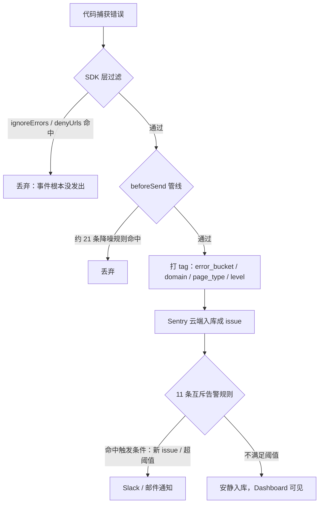
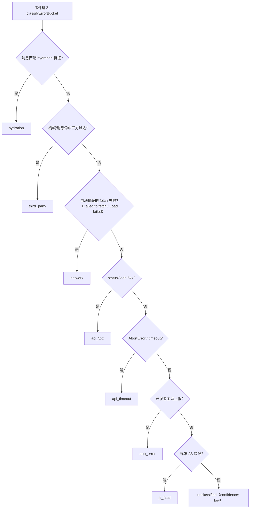
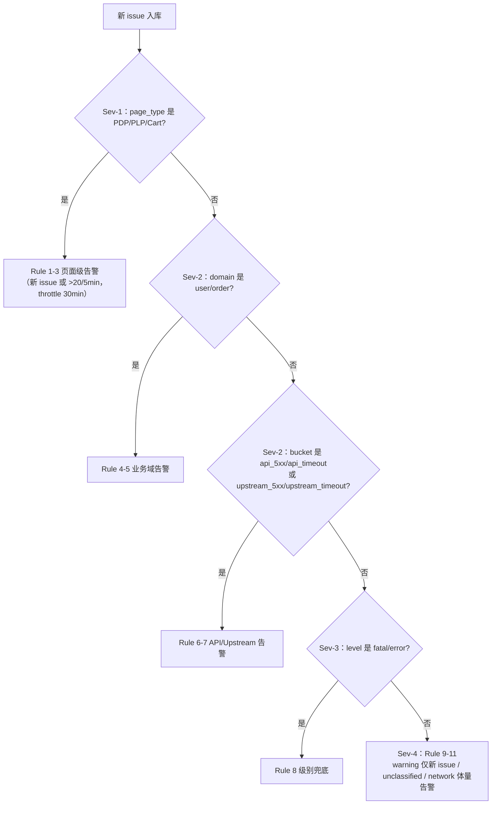
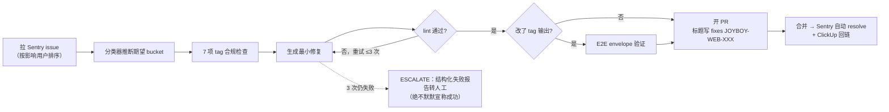

# 可观测性 + 异常上报 + Sentry（面试笔记）

> 用法：「解释版本」用于自己理解，「面试版本」是可以直接口述的 30~60 秒回答。
> 事实校准来源：`docs/observability-deep-dive/`（01~05），权威规则源 `docs/ai-specs/observability/`。

---

## Q1. Sentry 在你们系统里负责什么？

### 解释版本

负责四件事：线上错误发现、业务上下文归因、第三方噪音过滤、发布后回归追踪。

它不是只看 stack trace——每个事件都带 `domain`（业务域）、`page_type`（页面类型）、`error_bucket`（错误分桶）、`level`（由 domain severity 映射）、`release` 等 tag，所以能回答：错误发生在哪个业务域、是不是新版本引入的、影响多大、要不要马上处理。性能/RUM 不归它管（那是 Datadog→Grafana 链路，见 Q2）。

**一条事件的完整命运（三段式）：**

### 面试版本

Sentry 在我们系统里做错误监控和业务归因，不是单纯收 stack trace。我们在上报链路里统一给每个错误打上业务域、页面类型、错误分桶这些 tag，所以它回答的是"哪个业务域报错了、是不是新 release 引入的、影响面多大、要不要立即处理"，而不只是"哪里抛了异常"。性能和链路观测我们放在另一条线上，Sentry 专注错误。

---

## Q2. Datadog 在你们系统里负责什么？它和 Sentry 的边界是什么？

### 解释版本

- **Sentry = 错误归因**：JS error、Server Action 抛错、接口异常。回答"哪里报错、为什么、影响谁"。
- **Datadog（正向 Grafana/OTel 迁移）= 性能与链路**：回答"哪里慢、慢多久、慢在哪一段"。

当前实际状态（2026 年中）：web 端 Datadog RUM 已停用（代码保留、初始化被注释）；服务端 dd-trace 还在跑，主要价值是 `logInjection: true` 给日志注入 trace_id，把日志和 APM trace 串起来。规划是用 OpenTelemetry 全面替换 Datadog，目标态分工是 **Sentry 看"为什么失败"（异常/root cause），Grafana 看"影响多大"（指标/漏斗/SLO）**，中间用业务伞状 ID `txn_trace_id` 贯穿。

### 面试版本

边界很清晰：Sentry 管错误归因——哪里报错、为什么、影响谁；Datadog 管性能和链路——哪里慢、慢在哪一段。实际演进上我们前端 RUM 已经停用了 Datadog，服务端只保留 dd-trace 做日志 trace 注入，正在往 OTel + Grafana 迁。目标态是 Sentry 看"为什么失败"，Grafana 看"影响多大"，两边用一个业务侧的 trace id 串起来。线上排障时两个工具一起用，但主职责不重叠。

---

## Q3. 你们怎么做错误分桶？error_bucket 是怎么定义的？

### 解释版本

分桶在 Sentry `beforeSend` 里统一做，单一事实源是 `error-bucket.ts`：

1. 从 event 取 message、errorName、stack frames、statusCode、mechanism（是否主动上报）；
2. 调 `classifyErrorBucket`，按**固定优先级**先匹配先赢；
3. 写入 `error_bucket` 和 `bucket_confidence` 两个 tag；
4. 再继续走 ~21 条降噪过滤规则。

10 个 bucket，客户端 8 个 + 服务端专属 2 个：

- 客户端：`hydration → third_party → network → api_5xx → api_timeout → app_error → js_fatal → unclassified`
- 服务端：`upstream_5xx → upstream_timeout → app_error → js_fatal → unclassified`

优先级的次序本身就是语义，三个经典例子：

- **third_party 先于 api_5xx**：防止 DY/Stripe 域的 5xx 污染 api_5xx 统计；
- **network 在 third_party 之后**：落进 network 的只剩自有域或关键三方的 fetch 失败（`Failed to fetch (domain)` 反向解析 domain 判定）；
- **app_error 先于 js_fatal**：`captureStructuredError(new TypeError(...))` 归 app_error——开发者主动上报的意图优先于错误类型启发式；但 HTTP 状态码又优先于上报意图（主动报的 5xx 仍归 api_5xx）。

> Hydration 放第一个，不是因为它最严重，而是因为它的判别式最准、最窄；在 first-match 流水线里，这种桶必须最先截获，否则会被 third_party / js_fatal 等更宽规则吞掉，告警和仪表盘都会看错病。

业务代码只负责带 domain/pageType 等上下文，不重复实现分桶。告警规则按 bucket + domain + page_type 组合过滤，而不是所有错误一股脑报警。

**分类器的判定链（先匹配先赢）：**

### 面试版本

我们的分桶收敛在 beforeSend 的一个分类器里，产出 error_bucket 和置信度两个 tag。客户端分 hydration、third_party、network、api_5xx、api_timeout、app_error、js_fatal 八类，服务端另有 upstream 5xx/timeout 两类。关键是分类有严格优先级，比如第三方脚本先于 api_5xx 判定，避免 Stripe 这种域的 5xx 污染我们自己的接口统计；开发者主动上报的错误归 app_error 而不是 js_fatal，尊重上报意图。分桶是告警路由的基础——告警按 bucket 加业务域组合，不是一刀切。

---

## Q4. 为什么要做 11 条互斥告警规则？

### 解释版本

目标是**每个 issue 恰好触发一条规则**，防止一个错误在多个通道重复报警。做法是四层优先级，每层显式排除所有更高层的范围：

- **Sev-1**：page_type（PDP/PLP/Cart——核心转化页面，warning 级错误也要告警）
- **Sev-2**：domain（user/order）+ bucket（api_5xx/api_timeout、upstream）
- **Sev-3**：level（fatal/error 兜底）
- **Sev-4**：warning 仅新 issue、unclassified、network 仅体量告警（>200/5min，捕捉 DNS/CDN 故障）

为什么 cart/product/search 需要 Sev-1 page_type 规则：它们 severity=MEDIUM→Sentry level=warning，如果只按 level 兜底（Sev-3 只覆盖 fatal/error），核心页面的 warning 错误就整个漏掉了。domain 优先于 bucket：user/order 域里的 api_5xx 走 domain runbook，不重复进 API 告警。同类型 bucket 合并（api_5xx+api_timeout 一条规则）减少 runbook 碎片化。

**互斥路由的判定过程（每层显式排除上层，一 issue 一通道）：**

### 面试版本

核心目的是每个 issue 只进一个最合适的告警通道，避免重复报警和告警风暴。实现上是四层互斥：先按核心页面类型（PDP/PLP/Cart），再按业务域和错误分桶，再按 fatal/error 级别兜底，最后是低优先级的仅新 issue 和体量型告警。每条规则的过滤条件都显式排除更高层的范围。设计里有个细节：购物车、商品这些域的错误级别只是 warning，如果没有页面类型这一层高优规则，它们永远到不了 fatal/error 的兜底告警——所以分层不是拍脑袋，是由 severity 映射反推出来的。

---

## Q5. 如何避免告警风暴？

### 解释版本

思路不是"少报"，而是**分层降噪 + 聚合 + 阈值**，保证进来的都是有效错误：

1. **SDK 层**：`ignoreErrors`（纯噪音消息）、`denyUrls`（非关键三方脚本，自动从三方域名清单派生）——事件根本没发出；
2. **beforeSend 层**：先分类打 tag，再走 ~21 条降噪规则（Klaviyo 栈溢出、Google Translate DOM 噪音、WebView bridge、离线网络错误、无我方代码栈帧的三方错误…）；
3. **告警规则层**：互斥分层 + 触发阈值（新 issue 或 N 次/时间窗）+ throttle（30min~24h）；
4. **体量型兜底**：network 这种瞬态多的 bucket 只在 >200/5min 才告警，平时靠 Dashboard widget 保持可见性。

关键边界：`denyUrls`/`ignoreErrors` 里**绝不放关键三方**（DY/Algolia/Stripe/PayPal）——它们的错误必须到达告警规则，只能走 beforeSend 正常分类。

### 面试版本

我们的原则是保证上报质量而不是单纯砍量，分四层：SDK 层用 ignoreErrors 和 denyUrls 拦掉纯噪音；beforeSend 层先做分桶打标再走二十来条降噪规则，比如浏览器插件、WebView bridge、用户离线这类；告警层用互斥规则加频率阈值加 throttle 控制触发；对 network 这种天然瞬态的分桶只做体量告警，单次不打扰，可见性靠 dashboard 兜底。有一条铁律：关键三方服务（支付、搜索）的错误永远不能进丢弃名单，否则真出事时告警是哑的。

---

## Q6. tags 和 extra 有什么区别？为什么不能混用？（高频追问）

### 解释版本

- **tags**：被 Sentry 索引、可用于搜索和告警 filter，必须**低基数**（domain/page_type/error_bucket 这种枚举值）。11 条告警规则的 filter 全部依赖 tags。
- **extra**：不索引，仅展示用，随便放调试信息（请求参数、状态快照）。

混用的两个方向都出事：把高基数字段（orderId、userId、URL）放进 tag → Sentry 索引爆炸、性能劣化；把告警依赖的字段放进 extra → 告警规则永远匹配不到，issue 静默。我们迁移老代码时专门定了一条规则：**tags 不得拍平进 extra**。交易链路也只保留 `txn_trace_id`/`provider`/`order_id` 三个自定义 tag，其余全进 extra。

### 面试版本

tags 会被 Sentry 索引、能用在告警过滤里，所以必须低基数；extra 只是调试展示，不索引。我们所有告警规则都建立在 tags 上，所以混用是事故级的：高基数字段当 tag 会打爆索引，告警字段塞进 extra 会让规则匹配不到、issue 静默。规范上我们禁止把 tags 拍平进 extra，交易链路也只保留三个自定义 tag。

---

## Q7. 第三方错误怎么识别？关键第三方（支付/搜索）出错怎么办？

### 解释版本

`error-bucket.ts` 里维护两份清单（**唯一数据源，禁止他处重复维护**）：

- `THIRD_PARTY_PATTERNS`：~50 个非关键三方（GTM、Klaviyo、Facebook…）→ 归为 `third_party` bucket + 派生 `denyUrls` 直接丢弃；
- `CRITICAL_THIRD_PARTY_PATTERNS`：DY、Algolia、Stripe、PayPal 等 → **永不归 third_party、永不进 denyUrls**，错误必须到达告警。

判定是帧级 + 消息级的：栈帧或消息命中三方模式即分类；`Failed to fetch (domain)` 反向解析 domain 做归属。关键三方如果栈里**没有我方代码**，事件保留但打 `criticalThirdParty: 'yes'` tag，不会被我方代码检测（hasOwnCode）误杀。清单本身有重叠（dy.com 同时出现在两份列表），靠判定函数里的关键服务豁免解决——这是刻意设计不是 bug。

### 面试版本

我们把第三方分成关键和非关键两档，用一份清单统一维护。非关键的（GTM、社交媒体像素）归 third_party 分桶并在 SDK 层直接丢弃；关键的（Stripe、PayPal、Algolia 这些支付和搜索依赖）永不丢弃、永不归噪音桶，错误必须到达告警——即使栈里没有我们一行代码，也会打上专门标记保留下来。清单是全局唯一数据源，连 Sentry SDK 的 denyUrls 都是从它自动派生的，避免多处维护漂移。

---

## Q8. 页面级上下文（domain/page_type）是怎么注入的？为什么每个 page 都要自己调？

### 解释版本

三个 API 分工：

- 同步 layout → `<SentryContextProvider>`（client 组件，内部调 `setGlobalSentryContext`）；
- 每个 `page.tsx` → 函数体第一行**必须**调 `setGlobalSentryContext`；
- async layout（例外）→ 第一个 `await` 之前先手动调（Provider 要等 await 完才渲染，await 本身抛错就丢上下文）。

写入的是 Sentry 的 **isolation scope**——服务端由 AsyncLocalStorage 保证 per-request 隔离，同请求内的 Server Action 和 fetch 自动继承 tags。为什么 page 必须自己调：**React 并发渲染不保证 layout 和 page 的执行顺序**，page 里的异步操作可能在 layout 渲染前就跑完并抛错。下游 `captureStructuredError` 通过 enrichContext 读 isolation scope 自动补 domain/pageType——所以页面组件里上报通常只需传 severity 和 extra。

配套细节：单次上报用 `withScope`（局部 scope）而不是 `withIsolationScope`，因为浏览器没有 async context strategy，写 isolation scope 会跨请求污染。

### 面试版本

我们在请求级别用 Sentry 的 isolation scope 注入上下文，服务端靠 AsyncLocalStorage 做到 per-request 隔离，同请求内的 Server Action 和 fetch 自动继承。注入分三个位置：layout 用 Provider 组件、每个 page 必须自己调一次——因为 React 并发渲染不保证 layout 先于 page 执行，page 里的异步报错可能发生在 Provider 渲染之前；async layout 则要在第一个 await 之前手动调。这套规则是 ESLint 强制的，关键页面少了这行直接 CI 报错。

---

## Q9. Server Action 的错误处理为什么分两条路径？

### 解释版本

| 路径                             | API                                             | 行为                                                                                 |
| -------------------------------- | ----------------------------------------------- | ------------------------------------------------------------------------------------ |
| Throw 路径（错误应冒泡给调用方） | `withServerActionInstrumentation`               | span + breadcrumb + catch 后 capture 并 **re-throw**（包装成带 Event ID 的安全错误） |
| 优雅降级路径（页面要能继续渲染） | catch 内 `captureStructuredError` + `return {}` | 记日志 + 上报 + 返回降级值                                                           |

误用后果：降级路径用了 wrapper → re-throw 把降级变成 500。这个误用有 ESLint 规则专门检查。降级路径的典型例子是三方服务（Dynamic Yield）——挂了返回空对象让页面无推荐位渲染，错误照报。同时这类三方 action 不硬编码 domain，由调用页面的上下文继承。

### 面试版本

按错误的业务语义分两条路：应该冒泡的用 instrumentation wrapper 包一层，它会自动加 span、记 breadcrumb、捕获后重抛一个带事件 ID 的安全错误；需要优雅降级的在 catch 里手动上报然后返回空值，保证页面继续渲染——典型场景是第三方推荐服务挂了，页面只是少了推荐位而不是整个 500。两条路用错有实际后果：降级路径用了 wrapper 会被强制 re-throw，所以我们加了 lint 规则防这种误用。

---

## Q10. 为什么 Edge/middleware 里不做 Sentry 上报？

### 解释版本

这是架构决策，不是能力问题：middleware 是每次请求的热路径，在 Edge runtime 跑——Sentry capture 的开销和失败模式都不该出现在这里。规则是 middleware/edge 只用 `logger.*` 写 stdout（pino 检测到 edge 自动降级为 console JSON），日志由下游日志系统收集。edge 的 Sentry init 刻意极简：只开 console log 转发，**没有 beforeSend、没有 tracing**。这条规则有 ESLint error 级强制（`no-sentry-in-edge`），全 middleware 目录保持零 Sentry import。

### 面试版本

刻意的架构决策。middleware 是每请求热路径且跑在 Edge runtime，错误捕获的开销和 SDK 自身的失败模式不该出现在这一层。我们的规则是 edge 只写结构化日志到 stdout，由日志系统兜底；Sentry 的 edge 配置也只保留日志转发，没有过滤和 tracing。这条是 lint 的 error 级规则，不是约定俗成。

---

## Q11. 脱敏怎么做？金融/交易场景有什么边界？

### 解释版本

脱敏收敛在统一 observability 层，业务代码不各自处理，四道闸：

1. **`filterPII`**：`extra`/contexts 写入前递归过滤——**精确字段名匹配**（大小写不敏感），不是 regex。好处是 `isEmailVerified` 这种不误伤，代价是新敏感字段要显式登记；
2. **SDK 层**：`sendDefaultPii: false`，Sentry 不自动带用户信息；
3. **用户上下文**：`setUserContext` 只传 `{ id }`，不传 email/username（GDPR/PDPA）；
4. **Server Action 入参**：breadcrumb 记录参数前过 filterPII，FormData 转对象并截断 200 字符。

交易/金融边界：卡号、CVV、支付 token、cookie、authorization、支付 SDK 原始 payload 不进日志不进 Sentry；默认不上报完整请求/响应体，只保留 error code、status、domain、orderId、traceId 这类排查字段。

### 面试版本

脱敏收敛在统一上报层而不是业务代码里。上报前的 extra 和上下文会递归过一遍字段级脱敏——用的是精确字段名匹配而不是正则，避免误伤 isEmailVerified 这种正常字段；SDK 层面关掉默认 PII；用户上下文只传内部 id，不传邮箱用户名；Server Action 的入参 breadcrumb 也会先脱敏再截断。交易场景更严格：卡号、CVV、支付 token、鉴权头、支付 SDK 原始 payload 一律不进，默认只保留错误码、订单号、trace id 这类排查必需字段。

---

## Q12. 规范怎么保证被执行？（埋点覆盖率、lint、CI）

### 解释版本

靠一套 harness（8 组件治理框架）而不是靠自觉：

- **Static**：自研 ESLint 插件 8 条规则——page 必须有 context 调用、layout 必须有 Provider、禁裸 captureException、禁同一 catch 双报（logger.error + capture）、禁 edge capture、禁已删除的 PAGE_TYPES.SEARCH…关键页面是 error 级；
- **Gate**：lint-staged + CI workflow，error 级违规阻断合并；checkout/payment/cart 迁移未完成，这些路径对所有 Sentry API 发 warn（防提前接入）；
- **Evaluation**：纯 bash 的覆盖率扫描（page/layout 埋点率）+ baseline.json，每个 PR 自动评论覆盖率 delta——informational 不 block；
- **Feedback**：IDE 实时红线 + PR 评论 + AI 修复闭环。

### 面试版本

我们把规范做成了 lint 而不是文档约定：自研 ESLint 插件，页面缺上下文注入、裸调 Sentry API、同一处日志和上报双写、edge 里做捕获这些全是规则，核心页面是 error 级直接卡 CI。另有覆盖率扫描脚本统计每个页面和 layout 的埋点覆盖，PR 上自动评论和基线的 delta，只做展示不卡合并。本质是"规则定义在文档，强制在机器"。

---

## Q13. 怎么验证埋点真的生效了？（E2E 怎么测 Sentry？）

### 解释版本

不打真实 Sentry 云端，本地起 mock ingest 拦 envelope，双通道：

- **服务端**：构建期把 DSN 替换成本地 mock 地址（`localhost:8123`），standalone server 的 envelope 直接发到这里，解析成 ndjson；
- **客户端**：Playwright 用 `page.route` 拦截 sentry.io 的 POST，解析 envelope 并硬阻断真实上报。

测试手法：在核心页面（PDP/PLP/Home/Account）抛带真实 chunk URL 栈帧的合成错误，等 envelope 到达后断言 `page_type`/`domain`/`error_bucket` 三个 tag。核心页面之外的修复有定向测试生成器：拿线上 issue 的 transaction tag 生成一次性 Playwright 用例，验完即删。

工程坑位（体现真实经验）：必须跳过构建缓存（否则旧 DSN 残留）、必须用本地静态资源（否则 chunk 从 CDN 加载，Sentry 根本不初始化）。

### 面试版本

我们给 Sentry 做了本地 E2E：起一个 mock 的 Sentry 服务端，构建时把 DSN 换成本地地址，服务端的 envelope 直接落到本地文件；浏览器侧用 Playwright 拦截上报请求解析 envelope。然后在核心页面抛合成错误，断言 envelope 里的页面类型、业务域、错误分桶三个标签。对线上具体 issue 的修复，还有一个生成器按 issue 的页面路径生成一次性定向测试。这套东西最大的坑是构建缓存和 CDN 静态资源——不处理好，测的根本不是你以为的那份代码。

---

## Q14. AI 自动修复链路是怎么设计的？

### 解释版本

真实落地的是一套"人监督下的 AI 修复闭环"（alert-harness），不是无人值守全自动：

1. **拉取**：AI agent 通过 Sentry API/MCP 拉 issue（`is:unresolved !error_bucket:third_party`，按影响用户数排序），有增量快照和去重门（查已有 PR/任务）；
2. **推断**：用代码里同一个分类器推断期望的 error_bucket，和实际 tag 对比，做 7 项 tag 合规检查（domain 缺失、level 与 domain 不匹配等）；
3. **修复**：改代码 → 跑 observability lint → 影响 tag 输出的必须跑 E2E 验证；
4. **有界循环**：最多 3 次尝试，每次必须有非空 diff，失败输出结构化 ESCALATE 报告——**绝不默默宣称成功**；
5. **PR 闭环**：分支命名约定 + PR 标题写 `fixes JOYBOY-WEB-XXX`（合并后 Sentry 自动 resolve）+ 自动建任务工单回链；
6. **风控**：低风险才自动修；评分 rubric（文件范围/根因清晰度/测试覆盖/域耦合）超过阈值转人工；checkout/payment 文件不许动、middleware 不许动。人工只需要 review PR。

配套有每周定时 routine：每周自动 triage 个人名下最高影响的 issue。

**闭环流程（注意有界重试和 ESCALATE 出口）：**

### 面试版本

我们做的是"AI 修、人审"的闭环：agent 定期拉 Sentry issue，按影响面排序，用代码里同一个分类器推断这个 issue 本该是什么分桶、标签缺了什么，然后定位代码生成最小修复。关键设计是有界重试——最多三次、每次必须有实际改动、修完必须过 lint 和 E2E 验证，失败了输出结构化报告升级给人，不允许假装成功。低风险问题自动开 PR，人只 review；评分模型判定高风险的只出诊断报告不动代码，支付和中间件代码是禁区。PR 合并时通过标题里的 fixes 标记让 Sentry 自动关单，整个链路有工单系统回链。

---

## Q15. Runbook 里包含哪些内容？

### 解释版本

告警含义、影响范围、触发条件、排查入口、处理步骤、降级方案、owner 和升级路径、修复后的验证指标。

我们告警规则的设计直接决定 runbook 的结构：互斥分层保证一个 issue 只进一条规则，所以每条 runbook 的入口是唯一确定的；同类型 bucket 合并成一条规则（api_5xx + api_timeout → "API Errors"）就是为了减少 runbook 碎片化。目标：任何人接手不用重新理解系统，按步骤能定位止血。

### 面试版本

包含告警含义、影响范围、触发条件、排查入口、处理步骤、降级方案、owner 升级路径和修复后的验证指标。因为我们的告警是互斥的——一个 issue 只进一条规则——所以每个告警对应唯一一份 runbook，接手的人不用先判断"这个告警该看哪份文档"。

---

## Q16. Ownership 自动分配怎么做？

### 解释版本

不靠人肉分配。上报时统一打好 `domain`、`page_type`、`error_bucket` 等 tag，然后在 **Sentry 控制台的 Ownership Rules** 里配置路由规则（支持 `tags.xxx`、`path:`、`url:` 匹配器），issue 自动 assign 给对应 team/owner。

三级兜底：domain 显式 tag > page_type 推断 > 路径匹配（path:/url:）——全局错误（没有页面上下文的）只能靠最后一级，这也是目前 domain 覆盖的唯一缺口。规则顺序最佳实践：组合规则 → domain → path → url → 默认，每月审查。

### 面试版本

上报时每个错误已经带了业务域和页面类型标签，我们在 Sentry 控制台的 Ownership Rules 里按标签配路由，issue 自动分配给对应团队。兜底分三级：优先看显式的 domain 标签，其次按页面类型推断，最后按 URL 路径匹配——全局错误没有页面上下文，只能靠路径匹配，这也是我们覆盖率上唯一已知的缺口。

---

## Q17. trace 采样怎么设计？怎么防止 trace header 泄漏给第三方？

### 解释版本

**分层采样**：默认 0.1%，checkout 相关 20%，payment/capture 等关键事务 100%。两端 tracesSampler 都**优先透传 parentSampled**——保证 client→server 采样决策一致、trace 不断链。

**防泄漏**（这是个有故事的坑）：Sentry v9+ OTel 化之后，**创建 span 就会注入 `sentry-trace`/`baggage` header，且注入发生在 tracePropagationTargets 过滤之前**——只配 targets 防不住，会破坏第三方域的 CORS preflight。所以双闸门：

1. 不设 tracePropagationTargets，用 SDK 默认（仅 localhost + 相对路径）；
2. 配 `shouldCreateSpanForRequest`：非自有域的请求**根本不创建 span**，从源头断掉注入。

配套：CORS middleware 显式放行 `sentry-trace, baggage` 请求头。手写 span 只暴露两个原语：`withServerActionInstrumentation`（Server Action）和 `withFetchSpan` 家族（服务端 fetch），边界清晰防滥用。

### 面试版本

采样是分层的：全站千分之一，结账链路百分之二十，支付关键事务全采，并且前后端都优先尊重上游的采样决策，保证 trace 不断。比较有心得的是防泄漏：新版 Sentry SDK 一建 span 就会往请求里注 trace header，而且发生在目标白名单过滤之前，直接配白名单防不住、还会打坏第三方的 CORS 预检。我们的解法是双闸门——白名单保持默认只对同源，同时拦截器对非自有域根本不建 span，从源头不产生 header。

---

## Q18. unclassified / 低置信度的错误怎么处理？

### 解释版本

分类器兜底是 `unclassified`（`bucket_confidence: low`）。它不是垃圾桶而是**待办队列**：有专属告警规则但只报"新 issue"（24h throttle），价值在于定期有人去把 unclassified 里的新类型归类——要么扩展分类器规则，要么确认是合法的新错误类型。API 类告警规则里显式排除 `bucket_confidence:low`，防止误分类触发错误的 runbook。这是"分类器永远不完美"的工程化承认：给未知留出口，同时给出口配一个低成本的巡逻机制。

### 面试版本

分类不出的归 unclassified 并标低置信度。我们对它的态度是"待办队列"而不是垃圾桶：只对新 issue 低频告警，定期有人巡逻把新类型归类或扩展分类器；同时正式告警规则会排除低置信度事件，防止误分类带着错误的 runbook 半夜叫人。本质是给分类器的不确定性留一个可治理的出口。

---

## 附：面试中可能的概念题速答

- **"什么叫可观测性三支柱？"** Logs / Metrics / Traces。我们映射为：结构化日志（pino→Loki）、指标（Grafana，交易 SLO）、trace（Sentry tracing→OTel/Tempo），错误归因由 Sentry 承担，业务侧用 txn_trace_id 做伞状串联。
- **"harness 是什么？"** 这里指治理脚手架：Spec（规则定义）+ Static（lint）+ Dynamic（测试）+ Gate（CI）+ Feedback（反馈）+ Evaluation（量化）+ Knowledge（知识）+ Evolution（演进）八组件，把规范从"文档约定"变成"机器强制"。
- **"Sentry 的 isolation scope 是什么？"** 请求级隔离的上下文容器，服务端靠 AsyncLocalStorage 实现 per-request，写进去的标签同请求内所有上报自动继承；浏览器端无 async 隔离，所以单次上报要用局部 scope。
- **"告警疲劳怎么解？"** 互斥路由（一 issue 一通道）+ 分级响应（Sev-1 即时 page vs Sev-4 日报式）+ throttle + 体量型告警只看异常 spike。
