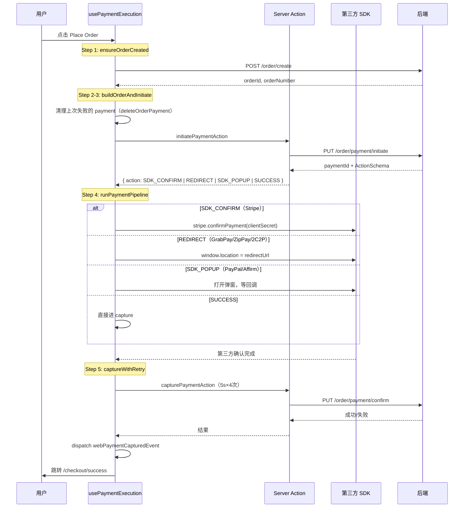

# Checkout & Payment 全链路深度拆解

> 基于 Joyboy 项目真实代码路径整理。定位：高级前端 + BFF 全栈水位。

---

## 一、全链路总览

```mermaid
flowchart LR
    CART["🛒 Cart"] -->|initCheckout<br/>POST /checkout/init| TOKEN["checkoutToken<br/>存 sessionStorage"]
    TOKEN --> ADDR["📍 Address<br/>选地址/验证"]
    ADDR -->|validateCheckoutAddress| SHIP["🚚 Shipping<br/>选配送/组装"]
    SHIP -->|updateShippingMethod| PAY["💳 Payment<br/>preInventoryReserve"]
    PAY -->|createOrder| ORDER["📦 Order Created"]
    ORDER -->|initiatePaymentAction| INIT["Payment Initiated"]
    INIT -->|SDK_CONFIRM / REDIRECT / SDK_POPUP / SUCCESS| ACTION["第三方交互"]
    ACTION -->|captureWithRetry| CAPTURE["Payment Captured"]
    CAPTURE --> SUCCESS["✅ Success Page"]
```



---

## 二、Cart → Checkout 过渡

**解释版本**

用户在购物车点击 Checkout 按钮时，前端做的事情是：

1. 收集购物车中所有 lineItemIds（商品 + 赠品 + 附加服务）
2. 调用 `POST /api/v1/checkout/init`，后端校验购物车合法性
3. 后端返回一个 `checkoutToken`（checkout session 的唯一标识）
4. 前端将 token 存入 `sessionStorage`（key: `x_checkout_session_token`）
5. 跳转到 `/checkout/shipping-address`

这个 token 非常关键 —— **后续所有 checkout API 请求都通过 `X-Checkout-Token` header 携带它**，它是服务端识别「这是哪个 checkout session」的凭证。

每个 checkout 页面都被 `CheckoutPermissionWrapper` 包裹，它会检查：
- 用户是否登录
- sessionStorage 中是否有 checkoutToken
- 是否完成了前置步骤（比如进 payment 页要先确认过 shipping method）
- 不满足就重定向回购物车

```
代码路径：
├── cart.helper.ts → initCheckoutCommand
├── cart.api.ts → POST /api/v1/checkout/init → 返回 { token }
├── sessionStorage → x_checkout_session_token
└── CheckoutPermissionWrapper → resolve-redirect.ts → 守卫逻辑
```

**面试回答版本**

"购物车到 Checkout 的衔接是通过一个 checkout session token。用户点 checkout 时，前端把 lineItemIds 发给后端做校验，后端返回 token 存在 sessionStorage 里。后续所有 checkout 接口都通过 `X-Checkout-Token` header 带上这个 token 来绑定 session。同时每个 checkout 页面都有 PermissionWrapper 做步骤守卫，防止用户直接跳到 payment 页。"

---

## 三、Checkout 三步流程

**解释版本**

Checkout 是典型的 **CSR-first 多步表单**。每个 `page.tsx` 只做 metadata 和无障碍 h1，真正的逻辑全在 `page.client.tsx` 里。

三步对应三个 URL 路由，不是前端 state machine：

| Step | 路由 | 核心操作 |
| --- | --- | --- |
| 1. Address | `/checkout/shipping-address` | 选/新增地址 → `PUT /checkout/address` 验证可配送性 |
| 2. Shipping | `/checkout/shipping-method` | 选配送方式/组装偏好/期望送达日 → `PUT /checkout/shipping-method` |
| 3. Payment | `/checkout/payment` | 库存预锁 → 选支付方式 → createOrder → 支付 |

步骤间跳转用 `router.push(nextStep.href)`，数据不是前端传递的 —— **每一步读写的都是同一个服务端 checkout session**（靠 token 绑定）。所以刷新页面不丢数据。

### 两个 Redux Slice 管理 Checkout 状态

| Slice | 职责 |
| --- | --- |
| `checkout` | 用户地址列表、当前 step、组装偏好、支付项列表、loading 状态 |
| `checkoutSession` | 服务端 session 镜像：summary（价格汇总）、lineItems、addressInfo、shippingMethod、zipcode |

### 进入 Payment 页时做了什么

1. 检查 checkoutToken 和 shipping method 是否已确认
2. 调用 `preInventoryReserve()` —— **锁定库存 6 分钟**（`POST /order/pre-inventory-reserve`）
3. 加载可用支付方式配置 `getPaymentMethodConfigs()`
4. 如果 URL 里有 `paymentStatus=failure`（从第三方回跳回来的失败），走恢复流程

```
代码路径：
├── apps/web/app/.../checkout/payment/page.client.tsx（260行）
├── checkout-session.api.ts → GET /api/v1/checkout/info
├── checkout.helper.ts → preInventoryReserveCommand
└── CheckoutPermissionWrapper → 要求 token + 登录 + shipping 已确认
```

**面试回答版本**

"我们的 Checkout 是 CSR-first 的三步流程：地址 → 配送 → 支付，每一步对应一个 URL 路由。数据不是前端传递的，而是读写同一个服务端 checkout session，靠 sessionStorage 里的 checkoutToken 绑定。进 Payment 页时会先做库存预锁（6 分钟 TTL），然后加载可用支付方式。每个页面有 PermissionWrapper 做步骤守卫，保证用户不能跳步。"

---

## 四、Order 创建

**解释版本**

有两条路径：

### 路径 A：正常订单（金额 > 0）

由 `usePaymentExecution` hook 的 `ensureOrderCreated` 方法触发：
1. 读取 checkoutToken
2. 调用 `createOrder` RTK mutation → `POST /api/v1/order/create`
3. 后端返回 `orderId`、`orderNumber`
4. 存入 sessionStorage（`webTransactionOrderId`）

### 路径 B：零元订单（优惠券全抵）

由 `createTransactionOrderCommand` 触发：
1. 直接调用 `POST /api/v1/order/create`
2. 返回 orderId 后，直接 `window.location.replace` 跳到 success 页
3. 不走支付流程

**orderId 由服务端生成**，前端从不自造订单 ID。

**面试回答版本**

"订单创建有两条路径。正常订单在用户点 Place Order 后、支付前创建，后端返回 orderId；零元订单（比如全额优惠券）不走支付，直接创建订单跳 success 页。订单 ID 始终由服务端生成。"

---

## 五、Payment 状态机

**解释版本**

支付不是一次 API 调用，是一个多步状态流。核心 hook 是 `usePaymentExecution`（935 行），编排了整个支付生命周期。

### 五步 Pipeline



### 四种 ActionSchema

| 类型 | 适用 Provider | 前端行为 |
| --- | --- | --- |
| `SDK_CONFIRM` | Stripe（信用卡/Apple Pay/Google Pay/Link） | 调 `stripe.confirmPayment(clientSecret)` |
| `REDIRECT` | GrabPay、ZipPay、2C2P | 跳转第三方页面，回来走 `/payment-callback` 轮询 |
| `SDK_POPUP` | PayPal、Affirm | JS 弹窗，`onApprove` / `onCheckoutSuccess` 回调 |
| `SUCCESS` | — | 跳过第三方，直接 capture |

### 每个 Provider 对应的 submit handler

```
usePaymentExecution 返回的方法：
├── onStripeCardSubmit      → elements.submit() → runPaymentPipeline
├── onGrabPaySubmit         → runPaymentPipeline → REDIRECT
├── onTwoCTwoPSubmit        → runPaymentPipeline → REDIRECT
├── onExpressButtonClick    → 预创建 order（Apple/Google Pay 点击时）
├── onExpressCheckoutSubmit → runPaymentPipeline
├── prepareSdkPayment       → buildOrderAndInitiate → SDK_POPUP（PayPal/Affirm）
├── onPaypalCapture         → captureWithRetry
├── onAffirmCapture         → captureWithRetry
├── onAffirmSubmit          → prepareSdkPayment → affirm.checkout.open
├── onSdkError              → trackTransactionFailure(PROVIDER_ERROR)
└── onSdkCancel             → reportTransactionMessage(USER_ABORT, skipSentry)
```

**面试回答版本**

"我们的支付是一个五步 pipeline：创建订单 → 清理旧 payment → initiate（拿到 ActionSchema）→ 根据 action 类型走不同第三方交互 → captureWithRetry。核心 hook 是 `usePaymentExecution`，900+ 行，每个 provider 有对应的 submit handler。ActionSchema 有四种：Stripe 走 SDK_CONFIRM，PayPal/Affirm 走 SDK_POPUP，GrabPay/2C2P 走 REDIRECT，特殊情况走 SUCCESS 直接 capture。"

---

## 六、支付策略模式

**解释版本**

后端支付逻辑用的是经典的 **Strategy + Factory** 模式，分三层：

```mermaid
flowchart TD
    subgraph "Actions 层（Server Action）"
        IA["initiatePaymentAction"]
        CA["capturePaymentAction"]
    end
    subgraph "Service 层"
        PS["PaymentService<br/>编排 + 能力检测"]
    end
    subgraph "Strategy 层（每个 provider 一个）"
        STRIPE["StripeStrategy<br/>SDK_CONFIRM"]
        PP["PaypalStrategy<br/>SDK_POPUP"]
        GP["GrabPayStrategy<br/>REDIRECT"]
        AF["AffirmStrategy<br/>SDK_POPUP"]
        TC["TwoCTwoPStrategy<br/>REDIRECT"]
        ZP["ZipPayStrategy<br/>REDIRECT"]
    end
    IA --> PS
    CA --> PS
    PS -->|factory.get(provider)| STRIPE
    PS -->|factory.get(provider)| PP
    PS -->|factory.get(provider)| GP
    PS -->|factory.get(provider)| AF
    PS -->|factory.get(provider)| TC
    PS -->|factory.get(provider)| ZP
```

`IPaymentStrategy` 接口定义三个方法：`initiatePaymentIntent`、`capturePayment`、`removeInitiatedPayment`。

可选 trait 接口：
- `ISubmitInformation`：Stripe 需要 `elements.submit()` 预提交
- `IConfirmPayment`：需要第三方确认步骤的 provider（Stripe/PayPal/Affirm）

Service 层用 **type guard** 检测策略是否实现了可选 trait：
```typescript
private hasSubmitInfo(s): s is IPaymentStrategy & ISubmitInformation
private hasConfirmPayment(s): s is IPaymentStrategy & IConfirmPayment
```

如果 `processPayment` 抛异常，Service 会**尽力回滚**（`removeInitiatedPayment`），但回滚失败不阻塞错误返回 —— 这是 best-effort cleanup，不是事务回滚。

**面试回答版本**

"支付后端用 Strategy + Factory 模式。`PaymentStrategyFactory` 根据 provider 枚举创建对应的策略实例，`PaymentService` 通过 type guard 检测策略是否实现了可选 trait（比如 `ISubmitInformation`、`IConfirmPayment`），然后按能力编排流程。这样新增支付方式只需要加一个 Strategy 类，不改编排逻辑。异常时会尽力回滚已创建的 payment intent，但这是 best-effort，不是事务保证。"

---

## 七、captureWithRetry 重试机制

**解释版本**

```
配置：
├── 单次超时：5s（Promise.race）
├── 最大重试：3 次（共 4 次尝试）
├── 退避：指数 1s → 2s → 4s（cap 8s，无 jitter）
├── 底层 fetch：30s socket 超时，0 次自动重试
└── 幂等：同一次 attempt 的所有 retry 复用同一 traceId 作为 idempotencyKey
```

关键设计决策：

1. **只有 timeout 才重试**。明确的成功或失败（包括卡被拒）立即返回，不重试
2. **全部超时的最终状态是 `processing`**，不是 failure。返回 `{ success: false, errorCode: 'processing' }`，前端展示"支付结果确认中"
3. **底层 fetch 的 30s 超时远大于 5s race**，所以永远是 race 先触发，底层请求在后台继续（不 abort）
4. **无 jitter**。代码注释说明了：当前 QPS 不高，不需要；高并发时应加随机抖动防止 thundering herd

```typescript
// capture-with-retry.ts 核心逻辑
for (let attempt = 0; attempt <= MAX_RETRIES; attempt++) {
  const result = await Promise.race([
    capturePaymentAction(params),          // 真实请求
    sleep(CAPTURE_TIMEOUT_MS).then(() => TIMEOUT_SENTINEL)  // 5s 超时
  ]);
  
  if (result !== TIMEOUT_SENTINEL) return result;  // 有明确结果就返回
  
  // timeout → backoff → retry
  if (attempt < MAX_RETRIES) {
    await sleep(Math.min(BASE * FACTOR ** attempt, MAX_DELAY));
  }
}
// 全部超时 → processing
return { success: false, errorCode: 'processing' };
```

**面试回答版本**

"captureWithRetry 用 Promise.race 做 5 秒超时检测。只有超时才重试，明确的成功或失败立即返回。最多重试 3 次（共 4 次尝试），指数退避 1s→2s→4s。全部超时后返回 processing 状态，前端展示'结果确认中'而不是报失败，因为后端可能已经扣款成功只是响应慢。所有 retry 复用同一个 idempotencyKey，后端幂等保证不会重复扣款。"

---

## 八、幂等设计

**解释版本**

```
idempotencyKey 生成链路：
├── 用户点 Place Order
├── startPaymentAttempt() → crypto.randomUUID() → traceId
├── traceId 作为 idempotencyKey 传给 Server Action
├── Server Action：idempotencyKey = params.idempotencyKey ?? traceId
├── Server Action → 后端 API（header 或 body 携带）
└── 后端根据 idempotencyKey 做去重
```

关键点：
- **每次新 attempt 生成新 traceId/idempotencyKey**。用户重新点 Pay 按钮 = 新的 attempt = 新的 key
- **同一次 attempt 内的 retry 复用同一 key**。captureWithRetry 的循环内 params 不变，key 不变
- 后端检测到重复 key 返回的错误码：`idempotency_key_in_use` / `resource_already_exists` / `duplicate_transaction`

这样设计的好处：
- 用户手快双击 → `isProcessing` flag 拦住第二次
- 网络重试（captureWithRetry）→ 同 key，后端幂等
- 用户主动重试（关弹窗再点）→ 新 key，后端视为新 attempt

**面试回答版本**

"幂等靠 idempotencyKey 实现。每次用户点 Pay 生成一个新的 UUID 作为 traceId，同时作为 idempotencyKey。同一次 attempt 内的网络重试复用同一 key，后端靠这个 key 去重，保证不会重复扣款。如果用户主动关闭错误弹窗重新点 Pay，会生成新 key，视为新 attempt。前端还有 isProcessing flag 防双击。"

---

## 九、错误分类与处理（30+ 种错误）

**解释版本**

`classifyPaymentError` 是所有支付错误的**单一入口**，按优先级瀑布分类：

```
分类优先级（从高到低）：
1. 订单状态错误（不可重试）：orderExpired / orderCanceled / paymentSuccessOrderCanceled
2. 已支付：orderAlreadyPaid
3. PayPal 专属错误
4. 网络错误：FETCH_ERROR / TIMEOUT_ERROR / NETWORK_ERROR + regex 匹配 "failed to fetch"
5. 待处理：processing / authorising / capturing
6. 取消/过期：user_canceled / auth_expired / session_expired
7. 服务端/客户端错误：INTERNAL_ERROR / HTTP 4xx/5xx
8. Provider 专属：3DS 失败 / 卡被拒 / 余额不足 / 地址不匹配 / 安全拦截
9. 兜底：genericPaymentError
```

### 错误展示方式

三种 display mode：
- `modal`（大部分支付错误）：阻塞弹窗，用户必须操作
- `toast`：自动消失提示
- `inline`：表单行内提示

### 特殊弹窗路由

| 错误类别 | 弹窗行为 |
| --- | --- |
| `orderExpired` | 双按钮：查看订单历史 / 继续购物 |
| `orderCanceled` | 联系客服弹窗 → 强制跳转订单历史 |
| `paymentSuccessOrderCanceled` | "查看订单" + 退款链接 → 强制跳转 |
| 卡被拒 / 3DS 失败 / 网络错误 | 标准错误弹窗 + i18n 文案 |

### 网络错误的双层检测

先看显式 errorCode（`FETCH_ERROR`, `TIMEOUT_ERROR` 等）；如果 code 是模糊的"包装码"（`UNEXPECTED_ERROR`, `CAPTURE_FAILED`, 空字符串），才用 regex 嗅探 message 内容。这样避免把 provider 返回的 message 里恰好有 "timeout" 字样的错误误分类为网络错误。

**面试回答版本**

"我们有一个统一的 `classifyPaymentError` 函数做错误分类，30+ 种类别按优先级瀑布匹配。最高优先级是订单状态错误（过期、取消、已支付），然后是网络错误、待处理、Provider 专属错误（卡被拒、3DS 失败等），最后兜底为通用错误。网络错误用双层检测：先看显式 code，code 模糊时才 regex 匹配 message，避免误分类。错误展示分三种：大部分是 modal 弹窗，特殊情况有专属弹窗路由，比如订单过期有双按钮弹窗。"

---

## 十、回调与轮询（REDIRECT 类 Provider）

**解释版本**

GrabPay、ZipPay、2C2P 是 REDIRECT 类 —— 用户跳转到第三方页面完成操作后，回到 `/checkout/payment-callback`。

回调页的核心逻辑：
1. 解析 URL query params：`orderId`、`provider`、`token`
2. Provider 白名单验证（只接受 GRABPAY/ZIPPAY/TWO_C2P）
3. 调用 `reconcilePayment({ orderId })` 轮询后端支付状态
4. **最多轮询 30 次，每次间隔 1 秒**
5. 收到 `paid: true` → 跳转 `/checkout/success`
6. 30 次轮询超时 → 展示"支付待确认"弹窗，引导用户去订单详情页查看
7. 缺少 orderId → 直接展示待确认弹窗

```
为什么用轮询不用 WebSocket？
- 支付回调是低频场景（用户一次支付一次回调）
- 简单可靠，不需要维护长连接
- 30 秒是合理的等待上限
```

PayPal 和 Affirm 不走回调页 —— 它们用 SDK_POPUP，JS 回调直接在原页面处理。Stripe 用 SDK_CONFIRM，也不走回调页。

**面试回答版本**

"REDIRECT 类支付（GrabPay/ZipPay/2C2P）用户从第三方页面回来后，进入 `/payment-callback` 页面。这个页面用轮询而不是 WebSocket —— 调 reconcilePayment 最多 30 次，每秒一次，直到后端确认 paid: true 跳 success 页，或者超时展示'结果确认中'引导用户去订单详情查看。PayPal/Affirm 走 SDK 弹窗回调，Stripe 走客户端 confirm，都不需要回调页。"

---

## 十一、多市场支付差异

**解释版本**

| 市场 | 支付方式 | 特殊点 |
| --- | --- | --- |
| US | Stripe + PayPal + Affirm | Affirm 是 BNPL 先买后付 |
| SG | Stripe + PayPal + GrabPay + 2C2P | 2C2P 支持 DBS/OCBC/UOB/Amex 分期 |
| AU | Stripe + PayPal + Afterpay + ZipPay | Afterpay 走 Stripe Afterpay 集成 |
| CA | Stripe + PayPal | 最简配置 |
| UK | Stripe + PayPal | 最简配置 |

- 货币通过 `MarketCurrency` 从 `@castlery/config` 集中管理
- 错误分类包含 `regionOrCurrencyError`（`country_unsupported` / `currency_not_supported`）
- 支付方式配置通过 env 文件控制（如 `NEXT_PUBLIC_AFFIRM_ENABLED=true`）

**面试回答版本**

"不同市场支付方式不一样。US 有 Affirm 分期，SG 有 GrabPay 和 2C2P 银行分期，AU 有 Afterpay 和 ZipPay。通过 env 文件配置开关，货币通过 MarketCurrency 统一管理。Strategy 模式的好处就是新增市场的支付方式只需要加一个 Strategy 实现。"

---

## 十二、安全 / PCI 合规

**解释版本**

核心原则：**前端永远不碰卡号**。

```
数据流向：
├── Stripe Elements（Stripe 的 iframe）收集卡号 → Stripe 服务器
├── 前端只拿到 clientSecret / paymentId / token
├── Server Action 只传递 token 和 ID → 后端 Go 服务
├── 后端 Go 服务才是真正的支付网关集成点
└── 所有 Strategy 文件标记 'server-only'，不会打包到客户端
```

PCI SAQ-A 合规：卡号在 Stripe iframe 内收集，前端代码从不 touch 敏感数据。

其他安全设计：
- Server Action 内校验身份和输入，不信任客户端传参
- `extractClientErrorMessage` 对错误消息做脱敏，只展示安全的文案
- `X_CHANNEL` header 标识市场，`x-trace-id` 做端到端追踪
- Server Action throw → `withServerActionInstrumentation`（自动上报 Sentry + re-throw）
- Server Action 降级 return → catch 里 `captureStructuredError`（不 re-throw）

**面试回答版本**

"PCI 合规的核心是前端永远不碰卡号。卡号在 Stripe Elements 的 iframe 内收集，直接发给 Stripe 服务器。前端只拿到 clientSecret 和 paymentId 这些 token。Server Action 作为 BFF 层也只传递 token，真正的支付网关集成在后端 Go 服务。所有 Strategy 文件标记 `server-only`，不会打包到客户端 bundle。"

---

## 十三、交易观测（Transaction Observability）

**解释版本**

支付链路的每一步都有观测打点，分布在三个层：

| 层 | 文件 | 打的 step |
| --- | --- | --- |
| Client Hook | `use-payment-execution.ts` | `create_order`、`payment_sdk_ready`、`payment_sdk_confirm`、`payment_popup`、`payment_redirect` |
| Server Action | `payment.action.ts` | `payment_initiate`、`payment_capture` |
| Strategy | 各 strategy + `strategy-observability.ts` | strategy 内部细粒度 start/success/failure |
| Retry | `capture-with-retry.ts` | retrying / timeout message |

### 防重复上报

三层都可能报同一个错误，靠 `skipSentry` 和 `markSentryReported` 去重：
- Strategy 层：`skipSentry: true`，Service 层统一上报 Sentry
- Client 层（initiate 失败）：`skipSentry: true`，Server Action 已经报过了
- `onSdkCancel`（用户取消）：`skipSentry: true`，用户行为不告警

### 关键字段

- `txn_trace_id`：伞状业务 ID，关联 Sentry ↔ Loki
- `step` + `result`：漏斗每一步的状态
- `errorCategory`：`PROVIDER_ERROR` / `SYSTEM_ERROR` / `TIMEOUT_ERROR` / `VALIDATION_ERROR` / `USER_ABORT`

**面试回答版本**

"交易链路每一步都有观测打点，分布在 Client Hook、Server Action、Strategy 三层。为了防重复上报 Sentry，用 skipSentry 标记：Strategy 层不报（Service 层统一报），Client 层对 initiate 失败不报（Server 已报），用户取消不报。所有打点共享一个 txn_trace_id 做伞状关联，可以在 Loki 里用这个 ID 回溯完整链路。"

---

## 十四、坑与边界情况

### 1. 第三方成功 ≠ 订单成功

Stripe `confirmPayment` 返回 success 只代表 Stripe 扣款意向确认了，后端 capture 可能还失败（余额不足、风控拦截、订单已过期）。**必须等 capture 返回才能判定成功**。

### 2. 浏览器关闭 / 网络中断

- REDIRECT 类：用户已经在第三方页面，后端靠 webhook 收到结果。用户回来后走 callback 页轮询。
- SDK 类：capture 请求可能在途。后端 idempotencyKey 保证不会重复扣款。用户再进来看到 processing 状态。

### 3. captureWithRetry 全超时

返回 `processing`，不是 failure。因为后端可能已经收到请求并成功处理了，只是响应慢。前端展示"支付结果确认中"，不能让用户立即重新支付（会重复扣款）。

### 4. 库存预锁过期（6 分钟）

用户在 Payment 页停留太久 → 库存被释放 → 下单失败。没有前端倒计时提示，是个已知体验缺口。

### 5. 旧 payment 清理

每次新 initiate 前，会先调 `deleteOrderPayment` 清理上次失败的 payment。如果清理失败，整个 flow abort，不会产生脏数据。

### 6. Express Wallet 预创建订单

Apple Pay / Google Pay 在用户**点击按钮时就开始创建订单**（不是确认时），因为 Apple Pay 弹窗出来后再创建订单太慢。用 `pendingOrderRef` 防止并发重复创建。

### 7. Affirm Flow B

Affirm 有两种流程。Flow B 是前端构建 checkout 对象传给 Affirm SDK，SDK 打开弹窗，用户在 Affirm 页面确认后回调 `onAffirmCapture`。

### 8. connect 无超时

Redis 连接（cache-handler.js）的 `client.connect()` 没有超时设置，如果 Redis 不可达可能阻塞服务启动。这是已知限制。

**面试回答版本**

"坑主要有几个：第一，第三方 SDK 成功不代表订单成功，必须等 capture 确认；第二，captureWithRetry 全超时返回 processing 而不是 failure，因为后端可能已经成功了；第三，库存预锁 6 分钟，Payment 页停太久会失败；第四，Express Wallet 在点击时就预创建订单，因为弹窗后再创建太慢；第五，每次新 payment 前要先清理旧 payment，清理失败就中止，不产生脏数据。"

---

## 十五、完整代码路径速查

```
Cart → Checkout:
  cart.helper.ts → initCheckoutCommand
  → POST /api/v1/checkout/init → { token }
  → sessionStorage: x_checkout_session_token

Checkout 三步:
  shipping-address/page.client.tsx → GET /checkout/info + /checkout/addresses
  shipping-method/page.client.tsx → GET /checkout/info?needsShippingMethod
  payment/page.client.tsx → POST /order/pre-inventory-reserve

Order 创建:
  use-payment-execution.ts → ensureOrderCreated
  → POST /api/v1/order/create → { orderId, orderNumber }

Payment:
  use-payment-execution.ts (935行)
  → payment.action.ts → initiatePaymentAction / capturePaymentAction
  → payment.service.server.ts → PaymentService
  → payment-strategy-factory.ts → StripeStrategy / PaypalStrategy / ...
  → capture-with-retry.ts (5s×4, backoff 1→2→4)

回调:
  payment-callback/page.tsx → reconcilePayment × 30 (1s 间隔)

错误:
  classify-payment-error.ts (30+ 类别，优先级瀑布)
  → usePaymentErrorHandler → use-payment-error-modal.tsx

观测:
  transaction-observability/ → trackTransaction* / captureTransactionError
  → txn_trace_id 伞状关联 Sentry ↔ Loki
```
